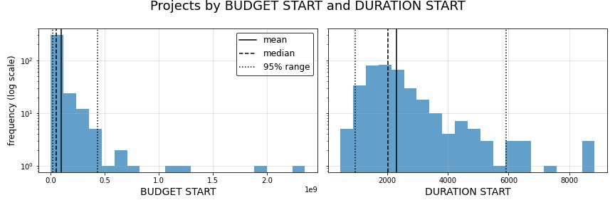
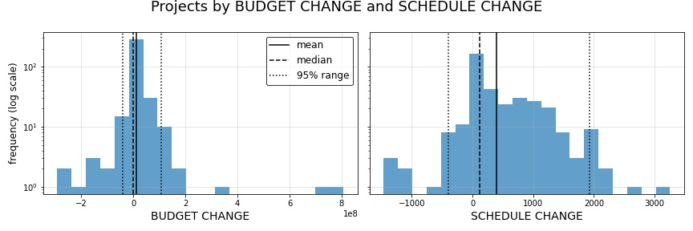
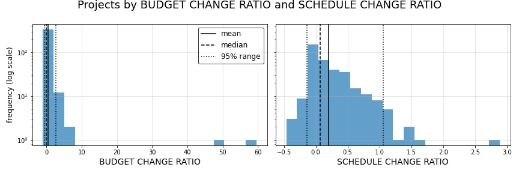

.. _intro:

1. About this analysis
======================

.. contents:: Contents
  :local:
  :depth: 2
  :backlinks: top

About this project
------------------

This site contains an exploratory analysis, wherein we attempt different approaches to modeling and feature engineering to predict 3-year outcomes for New York City managed capital projects with budgets greater than $25 million using `an openly available dataset hosted by NYC Open Data <datasource_>`_. Due to the limited scope and amount of data available in this dataset, this project can only be thought of as a proof of concept, which will need to replicated under more stringent standards with a larger set of more robust data.

.. _datasource: https://data.cityofnewyork.us/City-Government/Capital-Projects/n7gv-k5yt

.. note::

    **This project's online documentation is being actively developed.** Therefore this site currently contains little more than a starting skeleton with which to document the project and its findings as they are developed.

    * To view the in-depth analysis and findings associated with this project, the best resource to review will be `the Jupyter notebook located here <https://github.com/sedelmeyer/nyc-capital-projects/blob/master/notebooks/11_FINAL_REPORT.ipynb>`_.

Summary of initial findings
---------------------------

Overall, we found promising results that, given a limited amount of project data, moderately accurate predictions could be made as to the 3-year budget change ratio and schedule change ratio for changes made on NYC capital projects.

Modeling methods
^^^^^^^^^^^^^^^^

To acheive this, we explored a number of modeling methods ranging from basic linear regression (as an initial baseline), to smoothing spline generalized additive models (GAMs), to non-parameteric ensemble methods using decision tree regressors and boosting.

Feature engineering
^^^^^^^^^^^^^^^^^^^

In addition, using such a limited dataset, we sought to extract as much predictive information as possible from it by focusing heavily on feature engineering. Methods for feature engineering included competing methods for generating latent "reference class" categories for each project using K-means clustering as well as uniform manifold approximation and projection (UMAP) in combination with the HDBSCAN clustering algorithm. These reference class clustering algorithms took into account all categorical and quantitative characteristics of our training projects. Additionally, we used bidirectional encoder representations from transformers (BERT) embeddings of the textual information available for each project. We further encoded those embeddings into a smaller, more usable, feature-space through competing methods of dimensionality reduction including principal compenent analysis (PCA), latent space encoding with a dense autoencoder neural network, and UMAP.

Predictive results
^^^^^^^^^^^^^^^^^^

Not surprisingly, linear models lacked the expressiveness needed to successfully model our predictions, particularly those for the "budget ratio" change of our test projects. Not only were there significant differences in the predictive performance of models predicting **budget change ratio** versus those predicting **schedule change ratio**, but models also needed to be individually parameterized for optimal predictions on each of those two response variables.

In the end, through the use of ensemble decision tree regressors using boosting, we were able to achieve test :math:`R^2` scores of :math:`0.48` on our budget change ratio predictions and :math:`0.70` on our schedule change ratio predictions.

While there is still a great deal of additional work we can put towards this problem, we feel that this analysis is a good starting point for more principled exploration.

2. Exploratory data analysis (EDA)
----------------------------------

To give a better sense of the nature of the data contained in this dataset, it is likely useful to provide some visual representations of the types of projects available. For a more indepth review of the EDA conducted on this dataset, please refer to `the accompanying EDA and data cleansing notebook on GitHub <https://github.com/sedelmeyer/nyc-capital-projects/blob/master/notebooks/00_eda_and_clean_data.ipynb>`_.

.. figure:: ../../docs/_static/figures/01-projects-by-cat-barplot.jpg
  :align: center
  :width: 100%

  Figure 1: Capital projects by category

.. figure:: ../../docs/_static/figures/02-projects-by-agency-barplot.jpg
  :align: center
  :width: 100%

  Figure 2: Capital projects by managing agency

.. figure:: ../../docs/_static/figures/03-projects-by-borough-barplot.jpg
  :align: center
  :width: 100%

  Figure 3: Capital projects by NYC borough

.. figure:: ../../docs/_static/figures/04-projects-by-changes-barplot.jpg
  :align: center
  :width: 100%

  Figure 4: Capital projects by number of project change records

.. figure:: ../../docs/_static/figures/05-projects-by-age-barplot.jpg
  :align: center
  :width: 100%

  Figure 5: Capital projects by age of project at time of analysis

As can be seen in the horizontal barplots above, there were several categorical features available for each project. However, the categories provided were highly imbalanced, and as was the case with NYC borough designations for projects, not all categories were exclusive. Some categories overlapped and there were in some instances duplicative categories based on different naming conventions.

Additionally, in the final plot above, we can easily see illustrated supporting evidence for why 3 years was an ideal interval to select for our predictive analysis.

Now for a scatter matrix illustrating the correlative relationships of all quantitative variables in our dataset.

.. figure:: ../../docs/_static/figures/06-features-scatter-matrix.jpg
  :align: center
  :width: 100%

  Figure 6: Distribution of budget and duration change features by project

  (Click on image for more detail.)

As can be seen scatterplots above, many of the quantitative variables are heavily skewed with extreme outliers, particularly for budget-related metrics. There are also a number of variables with week correlation including relationships between starting budgets and schedules, as well as ending budgets and schedules. The variables exhibiting the greatest levels of correlation various change metrics that we created during our initial investigation of how to measure project change over our 3-year interval. Therefore, it would be expected that those features would ehibit high levels of correlation, and not particularly troubling, because those competing metrics will not likely coexist in any model that we build.

  Figure 7: Distribution of projects by originally budgeted project cost and originally scheduled project duration

  Figure 8: Distribution of projects by forecasted changes to project budget and project duration

  Figure 9: Distribution of projects by ratio of original vs. reforecasted change to project budget and project duration

As was highlighted in our analysis of the scatter matrix above, our core quantitative features related to budget and schedule are heavily shewed with extreme outliers. In addition, there are extreme difference in the scale of the values measured by each metric (i.e. budget is measured in hundreds of millions of dollars, while schedule is measured in thousands of days). These side-by-side histograms illustrate the severity of this problem.

These findings tell us that we will need to take great care in both scaling as well as transforming our quantitative predictors to mitigate these issues, particularly for classes of models where this will pose a major issue. 

Now let's looks at the change trends for some specific projects in our dataset.

.. figure:: ../../docs/_static/figures/10-project-603-trend.jpg
  :align: center
  :width: 100%

  Figure 10: Project change trend for project 603

.. figure:: ../../docs/_static/figures/11-project-480-trend.jpg
  :align: center
  :width: 100%

  Figure 11: Project change trend for project 480

.. figure:: ../../docs/_static/figures/12-project-96-trend.jpg
  :align: center
  :width: 100%

  Figure 12: Project change trend for project 96

.. figure:: ../../docs/_static/figures/13-project-482-trend.jpg
  :align: center
  :width: 100%

  Figure 13: Project change trend for project 482

As is illustrated by these time series of individual project changes above, we can see the varying degrees to which project budgets and durations change relative to one another within any singular project.

While the form of the data we will be using will represent a starting snapshot of each project as well as a 3-year snapshot of each project at the end of the prediction interval (effectively removing change-to-change variability over that period), these time trends tell us that budget changes and schedule changes, as they occur over time, appear to exhibit very little correlation to one another. Often times, counterintuitive and opposite changes in schedule duration appear to accompany comparable changes in budget.

It is definitely interesting to see how this seemingly independent behavior between budget changes and schedule changes manifests itself as we continue this analysis and begin fitting models to our data.

Now, armed with the basic underpinnings we have identified during our initial EDA and data cleansing activies, we are ready to define our research question and begin our model engineering process.

3. Research question
--------------------

After initial exploration and cleansing of the available data, we now focus our efforts on the following research question:

* *Given the set of New York City Capital Projects change data, can we create a model that can accurately predict 3-year change in forecasted project budget and 3-year change in forecasted project duration using only the data available at the start of the project as our predictors?*

* *In other words, using historical project data, can we predict how much the forecasted budget and duration of any given capital project run by the City of New York will deviate from it's original budgeted estimates by the end of year-3 for the project?*

The significance of a model that can accurately address this question means, given any new project, project managers and city administrators would have another tool at their disposal for objectively identifying potential budget and schedule risk at the start of a new city-run capital project. Such a tool can help to overcome common planning fallacies and optimism biases to help to mitigate cost and and schedule overruns.

Response variables
^^^^^^^^^^^^^^^^^^

Throughout the remainder of this analysis, the specific response variables we will be seeking to predict are:

1. ``Budget_Change_Ratio`` as defined by the total forecasted budget change (in dollars) for a project experienced during the 3-year interval divided by the initial starting budget of the project (i.e. `Budget_Start`) 

2. ``Schedule_Change_Ratio`` as defined by the total scheduled duration change (in days) for a project experienced during the 3-year interval divided by the initial start scheduled duration of the project (i.e. `Duration_Start`) 

Therefore, we are seeking to predict 2 response variables with all of the modelling methods investigated herein.