3. Exploratory data analysis (EDA)
==================================

The notebook used to generate the findings in this section :notebooks:`can be found here on GitHub<00_eda_and_clean_data.ipynb>`.

.. contents:: In this section
  :local:
  :depth: 2
  :backlinks: top

To gain a better sense of the nature of the data contained in this dataset, it is useful to provide some visual representations of the types of projects available. Shown below are a set of barplots illustrating the distribution of the full set of 355 projects in the cleansed dataset, plotted against several different dimensions.

Categorical attributes of each project
--------------------------------------

First, shown below are the projects distributed among the set of project categories as they were assigned in this initial dataset. This plot demonstrates the far greater proportion of projects designated as "Streets and Roadways" versus all other categories. It is also worth noting the very low count numbers for the several smallest categories. For the purpose of this analysis, we will merge several of these smaller groupings with other like groups to more evenly distribute the projects and to reduce the overall number of categories.

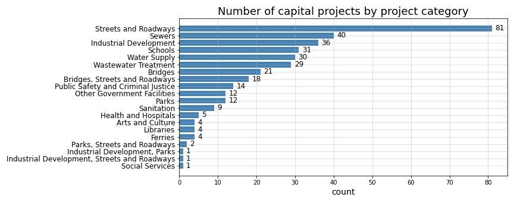

  Figure 1: Capital projects by category

This next plot illustrates the managing agency defined for each project. Once again, we can see that the most frequently occuring value appears at a far greater rate than all other agencies. This agency, `the Department of Design and Construction (DDC) <https://www1.nyc.gov/site/ddc/about/about-ddc.page>`_, is considered to be NYC's primary capital construction project manager. Therefore, the relatively large proportion of projects under the DDC's management is not necessarily surprising. Likewise, the second most frequent managing agency, `the Department of Transportation (DOT) <https://www1.nyc.gov/html/dot/html/about/about.shtml>`_, is also not surprising considering the large proportion of "Streets and Roadways" projects contained within the dataset.

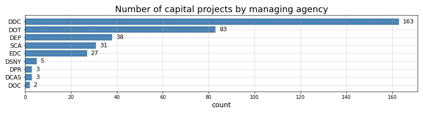

  Figure 2: Capital projects by managing agency

The next plot below shows the "borough" designation assigned to each project. The most obvious characteristic of this project attribute is the high proportion of projects without a specified borough. Of the projects assigned a borough designation, it appears that the list of "boroughs" is likely used to loosely to define the general location of each project. Shown here are not only the names of NYC's 5 actual boroughs — Manhattan, Brooklyn, Queens, The Bronx, and Staten Island — but also the names of other locales not even located within NYC. For example, Valhalla, New York, which is a hamlet of Westchester County, is listed here. However, the projects assigned to Valhalla in this dataset are associated with Kensico Resivoir, which is the site of Kensico Dam and a source of fresh water provided to NYC. Additionally, it appears that some projects are assigned multiple boroughs. Because of the large number of unspecified boroughs, the inclusion of non-borough localations, and the assignment of multiple boroughs to some projects, we can see that this particular project attribute will likely be of little use as a feature in our predictive analysis.

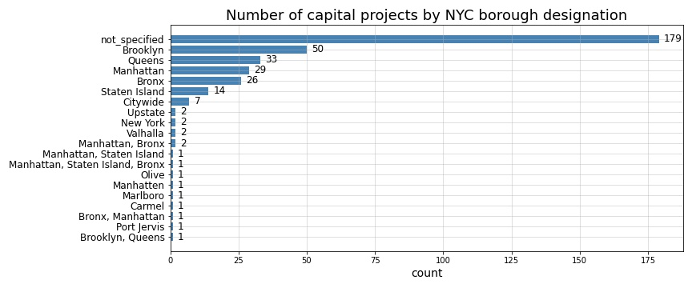

  Figure 3: Capital projects by NYC borough

Another categorical project attribute, ``Client_Agency`` exists in the original dataset for this analysis. However, unlike ``Managing_Agency``, ``Client_Agency`` not only includes many more sparsely assigned categories, but it also features a very large proportion of projects with no assigned client, and a number of projects assigned to multiple client agencies. For those reasons, ``Client_Agency`` has been ommitted from the plots shown above. Much like ``Borough``, the ``Client_Agency`` categorical feature will be of little use to us on its own. 

Project change records and the age of each project
--------------------------------------------------

Because we are primarily interested in the changes issued to each project over time, it will be useful to better understand the distribution of project changes issued to each project. In the first plot below, we can see that the 355 unique projects in our original *cleansed* dataset were issued varying numbers of changes over time. Each of these changes consists of either a change to the project's forecasted budget, a change to its scheduled duration, or a change to *both* of those attributes. As we can see, largest proportion of projects were issued no changes, meaning that the only record we have for any of those projects is the original record when the project was first added to the dataset. This could mean a couple things: either the project has been underway for some time and truly has had no changes, or it is one of the newer projects in the dataset (i.e. it is only one- or two-years-old and has not yet required any re-forecasting changes). To better see how these number of changes relate to other basic quantitative features of each project, please see the first row of :ref:`the scatter-matrix shown in Figure 6<figure6>` further below on this page.   

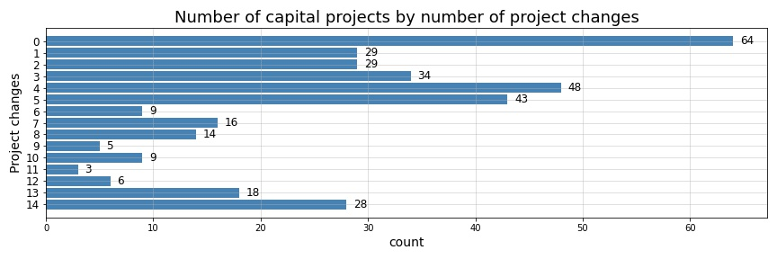

  Figure 4: Capital projects by number of project change records

In terms of the age for each project in our *cleansed* dataset, the majority of projects ranged from 1 to 5 years in age at the time this dataset was compiled on September 1st, 2019. As can be seen below, the mode is at 2 years of age with 67 projects, but the long tail for this distribution stretches out to a maximum of 27 years of age with more than 30 projects spanning 10 to 20 years in age.

.. _figure5:

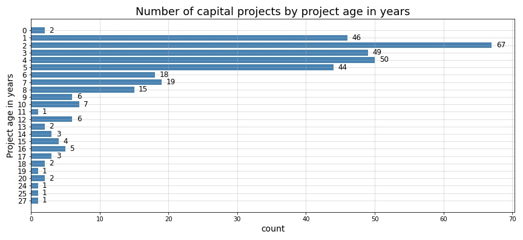

  Figure 5: Capital projects by age of project at time of analysis

The budgeted cost and scheduled duration of each project
--------------------------------------------------------

Now, by generating a scatter matrix of the quantitative features available in our *cleansed* dataset, we can gain a better understanding of the relationships and potential sources of collinearity among our project values for ``Number_Changes``, ``Budget_Start``, ``Budget_End``, ``Budget_Change``, ``Budget_Change_Ratio``, ``Schedule_Start``, ``Schedule_End``, ``Schedule_Change``, and ``Schedule_Change_Ratio``.

.. _figure6:

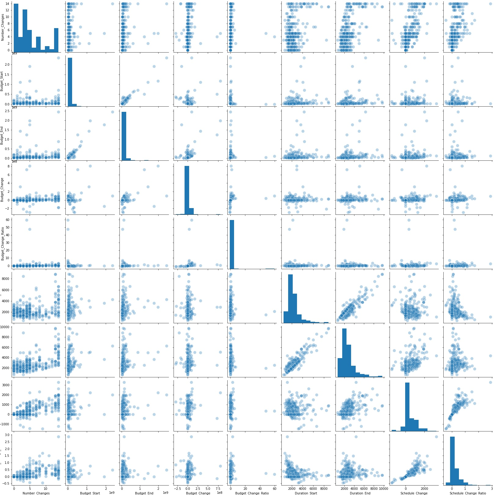

  (Click on image for more detail.)

  Figure 6: Distribution of budget and duration change features by project

As can be seen in the plots above, many of the quantitative variables are heavily skewed with extreme outliers, particularly for budget-related metrics. There are also a number of variables with fairly weak correlation including relationships between starting budgets and starting schedules, as well as ending budgets and ending schedules. The variables exhibiting the greatest levels of correlation are the various change-measures — ``Budget_Change``, ``Budget_Change_Ratio``, ``Schedule_Change``, and ``Schedule_Change_Ratio`` — that we created during our initial investigation of the data as was executed in :notebooks:`the first of our associated project notebooks on GitHub<00_eda_and_clean_data.ipynb>`. Therefore, it would be expected and not particularly troubling that those features would exhibit high levels of correlation, because those competing forms of measurement are not likely to coexist in any model that we build.

Particularly interesting in the scatter matix above, is that the number of change records per project (i.e. ``Number_Changes``) illustrated by the top row of subplots, demostrates no visually discernable correlation with the starting and ending budget and schedule values (the 4 lefthand subplots in the top row) and only weak correlation with the change measures (the 4 righthand subplots in that row). This tells us that project scale does not necessarily equate to more or fewer changes, and the the number of changes only weakly relates to the scale of the changes made to a project.

Something that we do find concerning though, is the skew and extreme outliers apparent in our ``Budget_Start``, ``Schedule_Start``, and change measures for both budget and schedule. This will be of particular concern while developing our models in subsequent sections of this analysis. The following sets of histograms demonstrate the severity of this skew.

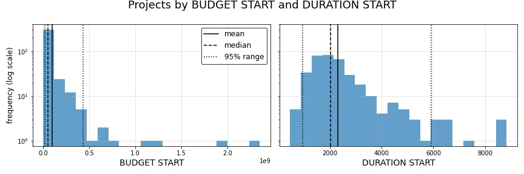

  Figure 7: Distribution of projects by originally budgeted project cost and originally scheduled project duration

As is shown above, the values for the initial starting budgets and scheduled durations for each project skews right. And, as can be seen, there are several notably extreme budget values present in this data. It is also worth noting here, the extreme difference in scale between one variable and the other. Whereas each project's schedule is displayed in thousands of days, budgets here are plotted by the hundreds of millions of dollars.

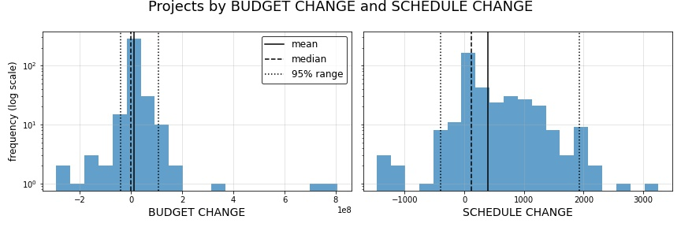

  Figure 8: Distribution of projects by forecasted changes to project budget and project duration

Next, while looking at total budget and schedule change, which is the total value of changes made to each project, we can see values that are less skewed, but that still contain outlying values. Something to note here is that these change plots also show us that changes to projects do not always lead to increases in budget and duration, and that in some cases projects actually decrease in forecasted budget and duration over time. 

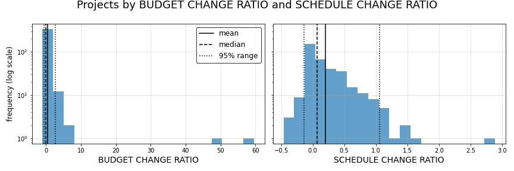

  Figure 9: Distribution of projects by ratio of original vs. reforecasted change to project budget and project duration

Finally, when we turn these changes into ratios to maintain the relative relationships of changes to each project's overall scale, we see that some projects stand out again as very extreme outliers.

These findings tell us that we will need to take great care in both scaling as well as transforming our quantitative predictors to mitigate issues of skew and varying scale while generating our predictive models in later sections of this analysis.

Project change trends
---------------------

Now let's looks at the change trends for some specific projects in our dataset.

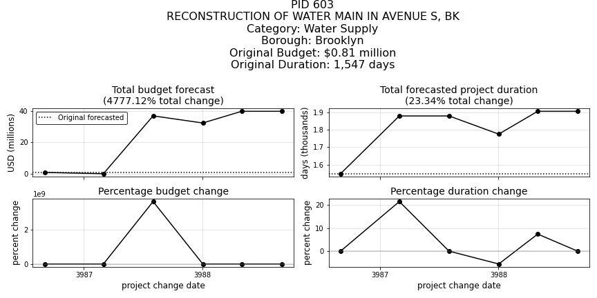

  Figure 10: Project change trend for project 603

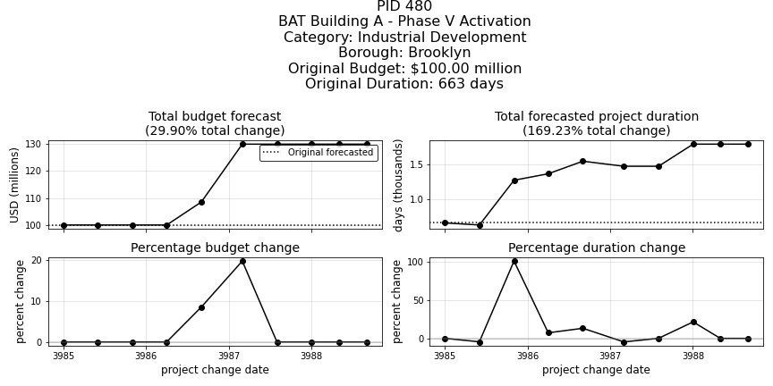

  Figure 11: Project change trend for project 480

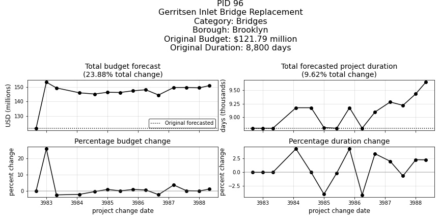

  Figure 12: Project change trend for project 96

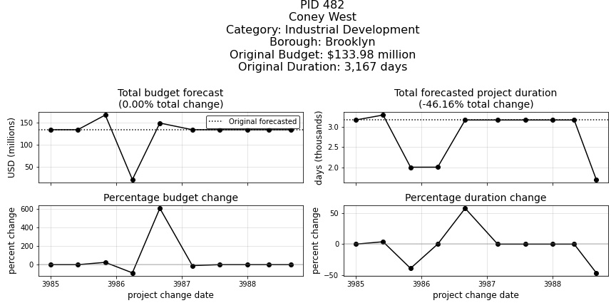

  Figure 13: Project change trend for project 482

As is illustrated by these time series of individual project changes above, we can see the varying degrees to which project budgets and durations change relative to one another within any singular project.

While the form of the data we will be using will represent a starting snapshot of each project as well as a 3-year snapshot of each project at the end of the prediction interval (effectively removing change-to-change variability over that period), these time trends tell us that budget changes and schedule changes, as they occur over time, appear to exhibit very little correlation to one another. Often times, counterintuitive and opposite changes in schedule duration appear to accompany comparable changes in budget.

It is definitely interesting to see how this seemingly independent behavior between budget changes and schedule changes manifests itself as we continue this analysis and begin fitting models to our data.

Now, armed with the basic underpinnings we have identified during our initial EDA and data cleansing activies, we are ready to define our research question and begin our model engineering process.
