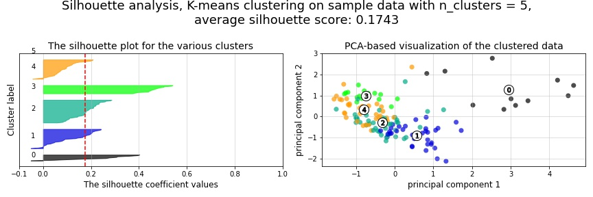
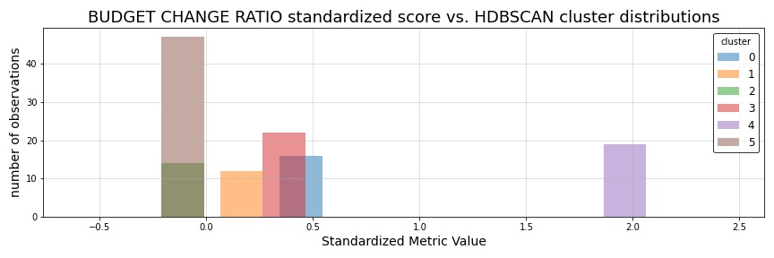

.. _cluster:

5. Reference class clustering
=============================

.. contents:: In this section
  :local:
  :depth: 1
  :backlinks: top

Methods used in this section
----------------------------

In the project management literature, particularly for academic research concerned with predicting project outcomes related to cost and duration overages, the concept of a project "reference class" is important to grouping like projects for the purpose of improved predictive accuracy. Due to :ref:`the limitations of the categorical variables present in our current dataset<categories>`, we have determined that, instead of using intuition or some predefined categorization of projects by type, we'd instead seek to algorithmically classify our projects. The objective we are seeking to accomplish, is to use all available types of quantitative and categorical data at the start of the project to identify some sort of "latent" reference class clusters derived from the totality of those features.

To accomplish this, we perform two competing approaches to clustering on our original feature data (being careful to use only features we would have access to when given a new project to predict). First we use a set of baseline clustering algorithms (K-means, DBSCAN, and Agglomerative Cluster with Wards Method) to generate an initial reference class feature for our training set.

Next, we seek to overcome some of the shortcomings of these methods by using Uniform Manifold Approximation and Projection (UMAP), combined with HDBSCAN, to generate a second competing set of reference classes. Ultimately, we will determine which, if either, of these engineered features improve the predictive accuracy of our regression models.

Now, let's get started prepping our data for use with K-means...

K-means clustering for reference class labels
---------------------------------------------

The unabridged notebook used to generate the findings in this section can be :notebooks:`found in Notebook 03 on GitHub<03_kmeans_attribute_features.ipynb>`.

.. contents:: In this section
  :local:
  :depth: 2
  :backlinks: top

Once we take care of the first steps of subsetting our data features to include only the predictive features we'd have available when encountering a new project, we need to first one-hot-encode our categorical features ``Category``, ``Borough``, ``Managing_Agency``, ``Client_Agency``, and ``Phase_Start``.

.. _scaling:

Scaling data to reduce skewness
^^^^^^^^^^^^^^^^^^^^^^^^^^^^^^^

Once those categorical variables are one-hot-encoded, we can take the next step of scaling our quantitative variables ``Budget_Start`` and ``Duration_Start``. Due to the heavily skewed nature of these features, their extremely different numerical scales, and the existence of exteme outliers :ref:`as were shown in our EDA<histograms>`, we will scale the data accordingly. To accomplish this, we first (1) standardize the data, we then (2) apply a sigmoid transformation to the standardized data to minimize the skew and impact of outliers, and we (3) then re-standardize the sigmoid transformed data to return it to a standard scale.

Therefore, if :math:`x_{ij}` represents an observed value :math:`i` for one of our quantitative variables :math:`j`, then our scaling of that variable can be represented as follows.

First, (1) each value :math:`x_{ij}` is standardized as such:

.. math::

   z_{ij} = \frac{x_{ij} - \mu_{x_j}}{s_{x_j}}

Then, (2) those standard values :math:`z_{ij}` are run through the sigmoid function:
  
.. math::

   z_{ij}^s =  \frac{1}{1 + e^{-z_{ij}}}

And finally, (3) the values :math:`z_{ij}^s` are re-standardized based on the mean (:math:`\mu`) and standard deviation (:math:`s`) of :math:`z_{j}^s`, giving us our final scaled values :math:`x_{j}'` for the quantitative variable :math:`x_j`:

.. math::

   x_{ij}' = \frac{z_{ij}^s - \mu_{z_{j}^s}}{s_{z_{j}^s}}

As can be seen in the two plots below, the 3-step scaling method we applied (standardize, sigmoid transform, and then re-standardize), as was defined above, does an adequate job of reducing (but not eliminating) the skew of our data and the magnitude of our outliers.

.. figure:: ../../docs/_static/figures/14-scaled-std-sig-train-scatter.jpg
  :align: center
  :width: 100%

  Figure 14: Original training data versus data that has been standardized, sigmoid transformed, and then re-standardized

This we believe is an important first step before clustering, primarily to get all variables on a more common scale, so that the distance-based clustering algorithms used here are not overwhelmed by just the Budget_Start values, which range in the hundreds of millions of dollars.

K-means at various :math:`k` numbers of clusters
^^^^^^^^^^^^^^^^^^^^^^^^^^^^^^^^^^^^^^^^^^^^^^^^

With our one-hot-encoding and scaling complete, we can now begin our attempt at clustering our observations. To begin this process, we will start with `the K-means clustering algorithm <https://en.wikipedia.org/wiki/K-means_clustering>`_. We will compare several sets of K-means clustering results in which we have partitioned our training projects into varying numbers of :math:`k` clusters. To accomplish this, we will run the K-means algorithm on our one-hot-encoded categorical variables ``Category``, ``Borough``, ``Managing_Agency``, ``Client_Agency``, and ``Phase_Start``, as well as our two scaled quantitative variables ``Budget_Start`` and ``Duration_Start``. We will do this for all consecutive values :math:`k`, 1 through 24. A set of diagnostic plots for these iterated K-means models are shown below.

.. figure:: ../../docs/_static/figures/15-kmeans-inertia-lineplot.jpg
  :align: center
  :width: 100%

  Figure 15: Within cluster variation versus number of K-means clusters

.. figure:: ../../docs/_static/figures/16-kmeans-silscore-lineplot.jpg
  :align: center
  :width: 100%

  Figure 16: Average silhouette score versus number of K-means clusters

  Figure 17: Gap statistic versus number of K-means clusters

As is often the problem with diagnostic metrics for evaluating K-means clustering, optimal values :math:`k` can be interpreted differently dependent on the evaluative methods used. For instance, in the inertia plot (Figure 15 above), the clustering results for each value :math:`k` is evaluated by plotting the "inertia" of each clustering result. This inertia is defined as the sum of squared distances of each data point to its assigned cluster's center. The typical approach is to inspect an inertia plot to identify the value :math:`k` at which we begin to achieve diminishing gains while reducing the relative standard deviation of the inertia for our clusterings. Ideally, we would hope for a clear "elbow" in our plot to demarcate this ideal value :math:`k`. Unfortunately, it is rather unclear whether any elbow exists in our inertia plot; although, careful visual inspection might indicate a slight visual kink in the line at either 2 or 3 clusters.

Next, in Figure 15, we visualize the average silhouette score for each of our clusterings. To clarify, the silhouette score is the mean silhouette coefficient for all samples in our cluster. This silhouette coefficient :math:`s` (as it is `succinctly defined in the scikit-learn documentation <silscore-sklearn>`_) is calculated using the mean intra-cluster distance :math:`a` and the mean nearest-cluster distance :math:`b` for each sample :math:`i`:

.. math::

   \frac{b_i - a_i}{max\{ a_i, b_i \}}

This silhouette coefficient shows which samples lie well within their cluster, and which are merely somewhere in between clusters (`Rousseeuw 1987 <silscore-paper_>`_). As can be seen in our plot of silhouette scores for each value :math:`k`, we achieve our highest average silhouette score at :math:`k=2`, suggesting that two clusters are optimal given this data.

Last, the Gap statistic plot indicates no conclusive result, as error bars overlap right from the start, but it does offer the intriguing feature that it jumps significantly at :math:`k=7`.

DBSCAN clustering comparison
^^^^^^^^^^^^^^^^^^^^^^^^^^^^

These inconclusive K-means results led us to next examine what kind of unsupervised clustering might be achieved using DBSCAN, where rather than selecting an optimal number of clusters explicitly, the algorithm would do that for us. 

.. figure:: ../../docs/_static/figures/18-dbscan-epsilon-lineplot.jpg
  :align: center
  :width: 100%

  Figure 18: Epsilon (i.e. 11 nearest neighbors distance) plotted by increasing observations

.. figure:: ../../docs/_static/figures/19-dbscan-cluster-barplot.jpg
  :align: center
  :width: 100%

  Figure 19: DBSCAN clustering results

For the DBSCAN model::

   DBSCAN(eps=2.25, min_samples=12):

       2 clusters were identified
       25 of the n=134 observations were not assigned a cluster
    
   The resulting silhouette score, excluding unclustered points:

       0.1843

The distribution of resulting labels are illustrated by this chart with un-clustered observations represented by the cluster labeled -1.

It was extremely difficult to find a set of parameters :math:`\epsilon` and ``min_samples`` that yeilded any sort of separation of our data into discrete clusers using DBSCAN.

Shown here was the most "reasonably separated" set of clusters we could achieve. Accoding to this we have 2 major clusters, one more heavily distributed with 94 observations, and a set of 25 observation not assigned to either category.

Agglomerative clustering comparison using Ward's method
^^^^^^^^^^^^^^^^^^^^^^^^^^^^^^^^^^^^^^^^^^^^^^^^^^^^^^^

As a final attempt to learn about the natural clustering of this data, we perform agglomerative clustering using Ward's method below, with the results plotted as a dendrogram.

.. figure:: ../../docs/_static/figures/20-wards-dendrogram.jpg
  :align: center
  :width: 100%

  Figure 20: Agglomerative clustering dendrogram

.. figure:: ../../docs/_static/figures/21-wards-silscore-lineplot.jpg
  :align: center
  :width: 100%

  Figure 21: Agglomerative cluster silhouette score by distance threshold :math:`t`

.. figure:: ../../docs/_static/figures/22-wards-cluster-count-lineplot.jpg
  :align: center
  :width: 100%

  Figure 22: Agglomerative cluster count by distance threshold :math:`t`

Here we can see how Ward's method identifies distances between observations with linkage points illustrated in the dendrogram above. Using this method, we can see the average silhouette score decrease as the distance threshold increases (the middle line plot), until it spikes at the last few threshold values :math:`t`. However, it is intersting to note just how quickly the number of clusters diminish as the threshold increases.

Overall, this method yields the highest average silhouette score at :math:`k=2` clusters.

K-means visual inspection and selection
^^^^^^^^^^^^^^^^^^^^^^^^^^^^^^^^^^^^^^^

Now that we are armed with this additional clustering information, we are going to inspect just a few sets of K-means clusters at a few values :math:`k` we think might be best suited to this data given our results above. Those will be :math:`k`'s of 2, 3, and 5.

.. figure:: ../../docs/_static/figures/23-kmeans-2-silplot.jpg
  :align: center
  :width: 100%

  Figure 23: K-means :math:`k=2` clustering results

.. figure:: ../../docs/_static/figures/24-kmeans-3-silplot.jpg
  :align: center
  :width: 100%

  Figure 23: K-means :math:`k=3` clustering results

  Figure 23: K-means :math:`k=5` clustering results

As can be seen in the silhouette analysis plots and 2-dimensional PCA representations above, all three values :math:`k` provide intriguing types of separation among our data. While we would have liked to incorporate K-means reference class classification features of several varying values :math:`k` in our engineered feature set for predictive comparisons in our regression models, we utlimately decided to choose just one K-means-derived reference class feature in favor of exploring other, more powerful clustering techniques as we illutrate below in section 3.1.2. In the end, we decided to balance clarity of separation as exhibited in the PCA plots above with a value :math:`k` which provided some degree of balance between the size and individual silhouette scores of several clusters. For that reason we choose :math:`k=3` for our eventual predictive reference class feature titled ``attributes_km3_label`` in our final model data.

UMAP clustering for reference class labels
------------------------------------------

The unabridged notebook used to generate the findings in this section can be `found here on GitHub <https://github.com/sedelmeyer/nyc-capital-projects/blob/master/notebooks/05_umap_hdbscan_features.ipynb>`_.

.. contents:: In this section
  :local:
  :depth: 2
  :backlinks: top

Disadvantages of PCA, Kmeans, DBSCAN
^^^^^^^^^^^^^^^^^^^^^^^^^^^^^^^^^^^^

Caveats of Kmeans K-Means is the "go-to" clustering algorithm for many simply because it is fast, easy to understand, and available everywhere. K-Means has a few problems however. The first is that it isn’t a clustering algorithm, it is a partitioning algorithm. That is to say K-means doesn’t "find clusters" it partitions your dataset into as many (assumed to be globular) chunks as you ask for by attempting to minimize intra-partition distances. Clusters found in kmeans are usually similar in shapes, with an assumption of largely spherical clusters.

Also, as we saw above, finding the optimum number of clusters can be challenging. The gap statistic and silhouette plots help, but finding the "elbow" was not too easy, nor does it necessarily correlate well with the number of natural clusters.

A competing approach using UMAP in combination with HDBSCAN
^^^^^^^^^^^^^^^^^^^^^^^^^^^^^^^^^^^^^^^^^^^^^^^^^^^^^^^^^^^

By using  HDBSCAN instead of the more standard DBSCAN, we can improve on our results by using a smarter density based algorithm. We chose HDBSCAN, which is an improved version of DBSCAN. Unlike DBSCAN, it allows variable density clusters. It also replaces the unintuitive epsilon parameter with a new parameter ``min_cluster_size``, which is used to determine whether points are "falling out of a cluster" or splitting to form two new clusters. HDBSCAN usually does very well with the points that it is confident enough to put into clusters, while leave out less confident points.

The need to use dimensionality reduction techniques in conjunction with HDBSCAN
^^^^^^^^^^^^^^^^^^^^^^^^^^^^^^^^^^^^^^^^^^^^^^^^^^^^^^^^^^^^^^^^^^^^^^^^^^^^^^^

We used HDBSCAN on the raw, one-hot-encoded data and got between 70% - 80% of the data clustered. While HDBSCAN did a great job on the data it could cluster it did a poor job of actually managing to cluster the data. The problem here is that, as a density based clustering algorithm, HDBSCAN tends to suffer from the curse of dimensionality: high dimensional data requires more observed samples to produce much density. If we could reduce the dimensionality of the data more we would make the density more evident and make it far easier for HDBSCAN to cluster the data. The problem is that trying to use PCA to do this can be problematic due to its linear nature. What we need is strong manifold learning, which graph-based methods like t-sne and UMAP can offer. We chose UMAP since it is faster and preserves global structures better.

Our goal is to make use of **uniform manifold approximation and projection (UMAP)** to perform non-linear manifold aware dimension reduction so we can get the dataset down to a number of dimensions small enough for a density based clustering algorithm to make progress. UMAP constructs a high dimensional graph representation of the data, with edge weights representing the likelihood that two points are connected. It chooses whether one point is connected to another or not using a local radius metric, based on the distance to each point's nth nearest neighbor, then optimizes a low-dimensional graph to be as structurally similar as possible.

Tuning UMAP The most important parameter is ``n_neighbors`` - the number of approximate nearest neighbors used to construct the initial high-dimensional graph. It effectively controls how UMAP balances local versus global structure - low values will push UMAP to focus more on local structure by constraining the number of neighboring points considered when analyzing the data in high dimensions, while high values will push UMAP towards representing the big-picture structure while losing fine detail. As ``n_neighbors`` increases, UMAP connects more and more neighboring points when constructing the graph representation of the high-dimensional data, which leads to a projection that more accurately reflects the global structure of the data. At very low values, any notion of global structure is almost completely lost.

**Sources and additional resources:**

* https://pair-code.github.io/understanding-umap/
* https://umap-learn.readthedocs.io/en/latest/clustering.html
* https://hdbscan.readthedocs.io/en/latest/comparing_clustering_algorithms.html

Getting started
^^^^^^^^^^^^^^^

To get started on this task, we trained UMAP transformer on the train set, and use that for getting 2D embedding from train data as additional features during training time. At inference time, we use the same transformer (fitted only on train) to transform the test set.

We can see from the visualizations below that the 2D embedding gives us some insight into our data. It shows separation between cluster of points, and their is some logic in the direction of the components with regards to our two target variable ``Budget_Change_Ratio`` and ``Schedule_Change_Ratio``.

**NOTE:** For the purpose of brevity and computational cost for this report, we import pickled versions of the resulting models below instead of re-run all of our exploratory models here. To view the full code used to generate these results, please see `the complete notebook on GitHub <https://github.com/sedelmeyer/nyc-capital-projects/blob/master/notebooks/05_umap_hdbscan_features.ipynb>`_.

.. figure:: ../../docs/_static/figures/26-umap-schedule-scale-scatter.jpg
   :align: center
   :width: 100%

   Figure 26: 2-dimensional UMAP reduction with ``Schedule_Change_Ratio`` color scale 

.. figure:: ../../docs/_static/figures/27-umap-budget-scale-scatter.jpg
   :align: center
   :width: 100%

   Figure 27: 2-dimensional UMAP reduction with ``Budget_Change_Ratio`` color scale

.. figure:: ../../docs/_static/figures/28-umap-category-color-scatter.jpg
   :align: center
   :width: 100%

   Figure 28: 2-dimensional UMAP reduction, color coded by project category

Clustering our UMAP projections
^^^^^^^^^^^^^^^^^^^^^^^^^^^^^^^

After our initial dimensionality reduction with UMAP, we then applied HDBSCAN on the resulted UMAP embedding and got much better results than clustering on our raw data. HDBSCAN was able to cluster > 99% of points, and the clusters all contained multiple types of project categories (as can be seen by examining the clusters below and comparing them to the category-colored scatterplot of the UMAP embedding above). We interperet this to mean that we were able to capture more information in our would-be reference classes than we might otherwise have been able to capture by using the existing defined categories present in the original dataset.

.. figure:: ../../docs/_static/figures/29-umap-hdbscan-color-scatter.jpg
   :align: center
   :width: 100%

   Figure 29: 2-dimensional UMAP reduction, color coded by HDBSCAN-assigned clusters

For comparison, the resulting average silhouette score for our two methods of reference class clustering, when measured against our original training data (without any feature engineering), are::

                         Silhouette Score
   K-means, k=3          0.1461
   UMAP with HDBSCAN     0.1798

As a point of comparison, now that we have a second set of reference classes to compete in our models against the [K-means cluster completed in section 3.1.1](#3.1.1.-K-means-clustering-for-reference-class-labels), we can most directly compare both sets of clustered reference classes by examining the average silhouette scores of those clusters on our original set of training data. As is shown in the output above, the UMAP with HDBSCAN method achieves a slightly higher avg. silhoutte score at 0.1798 than the K-means :math:`k=3` clusters, which scored 0.1461. While this might indicate better clustering using UMAP with HDBSCAN, the real test comes when we attempt to use each of theses engineered features in competing prediction models.

Understand characteristics of projects in each of our clustering labels:
^^^^^^^^^^^^^^^^^^^^^^^^^^^^^^^^^^^^^^^^^^^^^^^^^^^^^^^^^^^^^^^^^^^^^^^^

In our attempt to understand the 5 clusters/latent reference classes shown above, we used two approaches in our more complete notebook (which can be `found here <https://github.com/sedelmeyer/nyc-capital-projects/blob/master/notebooks/05_umap_hdbscan_features.ipynb>`_):

1. Fit 5 binary classification classifiers, each predicting the datapoints of one cluster vs the rest of the data

2. Select which variable has the highest variance between clusters, with the assumption that cluster-defining variables will have very different mean from one cluster to another.

However, since approach 2 yielded better results, for the sake of brevity, that is all we are showing below.

.. figure:: ../../docs/_static/figures/30-umap-hdbscan-spiders.jpg
   :align: center
   :width: 100%

   Figure 30: Comparison of HDBSCAN cluster project attributes

By plotting the cluster-defining features onto radar plots, we can find intuitive explanations for each of the clusters. For example, cluster 5 are projects that are Managed by DDC, with DEP as Client agency. They are typically Sewers construction projects in Queens. Overall, we see an interesting mixing of each categorical variable within our clusters, indicating that our clustering algorithm did a good job separating projects along more than one set of dimensions, and may taken into account a set of latent relationships between all our available features, adding more richness than we might otherwise be able to do by explicitly assigning the reference classes ourselves.

Now, since our main goal is to use these reference classes to help improve our predictions, we visualize the histogram of projects Budget Change Ratio and Schedule Change Ratio, colored by clusters in the two plots below.

   Figure 31: HDBSCAN clustering compared to ``Budget_Change_Ratio`` standardized values

.. figure:: ../../docs/_static/figures/32-umap-hdbscan-schedule-hist.jpg
   :align: center
   :width: 100%

   Figure 32: HDBSCAN clustering compared to ``Schedule_Change_Ratio`` standardized values

Based on these histograms, we can see that there are decent separation among our clusters in both of our response variable dimensions, ``Budget_Change_Ratio`` and ``Schedule_Change_Ratio``. The clustering labels as a feature may perhaps help us most in predicting outlier values (as evidenced by the separation of cluster 4 in ``Budget_Change_Ratio`` and cluster 3 in ``Schedule_Change_Ratio``) and may even help to distinguishing a set of other obervations from one another in our regressor models, except in areas of heavily overlapping clusters (e.g. clusters 2 and 5)

Clustering conclusions
^^^^^^^^^^^^^^^^^^^^^^

Now that we feel we have created a two sufficient sets of competing reference classes to test within our models, we move on the embedding the textual project-description data available in our data set.

Additional resources
--------------------

K-means clustering

DBSCAN

Ward's method

UMAP

HDBSCAN

Clustering evaluation methods:

* scikit-learn silhouette score
* wikipedia silhouette score
* original paper silhouette score

.. _gapstat-paper: http://www.web.stanford.edu/~hastie/Papers/gap.pdf

.. _gapstat-lib: https://github.com/milesgranger/gap_statistic

.. _silscore-sklearn: https://scikit-learn.org/stable/modules/clustering.html#silhouette-coefficient

.. _silscore-paper: https://www.sciencedirect.com/science/article/pii/0377042787901257?via%3Dihub

.. _silscore-wikipedia: https://en.wikipedia.org/wiki/Silhouette_(clustering)
