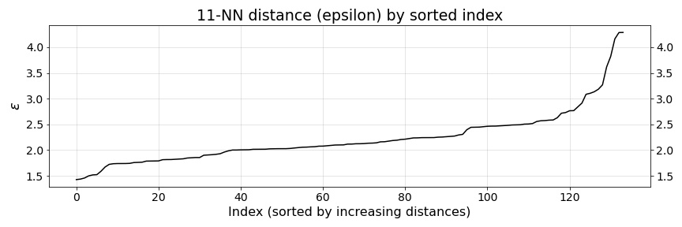
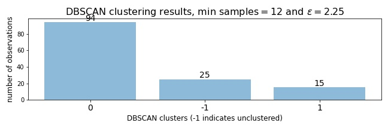
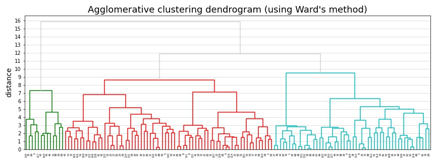
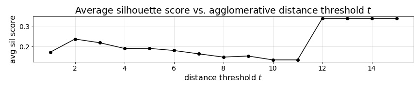
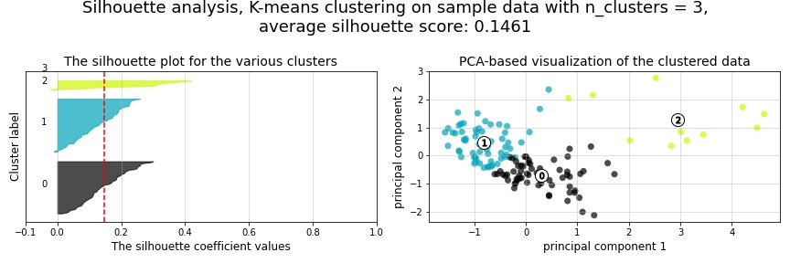

.. _cluster1:

5. Reference class clustering
=============================

.. contents:: In this section
  :local:
  :depth: 1
  :backlinks: top

Methods used in this section
----------------------------

In the project management literature, particularly for academic research concerned with predicting project outcomes related to cost and duration overages, the concept of a project "reference class" is important to grouping like projects for the purpose of improved predictive accuracy. Due to :ref:`the limitations of the categorical variables present in our current dataset<categories>`, we have determined that, instead of using intuition or some predefined categorization of projects by type, we'd instead seek to algorithmically classify our projects. The objective we are seeking to accomplish, is to use all available types of quantitative and categorical data at the start of the project to identify some sort of "latent" reference class clusters derived from the totality of those features.

To accomplish this, we perform two competing approaches to clustering on our original feature data (being careful to use only features we would have access to when given a new project to predict). First we use a set of baseline clustering algorithms (K-means, DBSCAN, and Agglomerative Cluster with Wards Method) to generate an initial reference class feature for our training set.

Next, we seek to overcome some of the shortcomings of these methods by using Uniform Manifold Approximation and Projection (UMAP), combined with HDBSCAN, to generate a second competing set of reference classes. Ultimately, we will determine which, if either, of these engineered features improve the predictive accuracy of our regression models.

Now, let's get started prepping our data for use with K-means...

K-means clustering for reference class labels
---------------------------------------------

The unabridged notebook used to generate the findings in this section can be :notebooks:`found in Notebook 03 on GitHub<03_kmeans_attribute_features.ipynb>`.

.. contents:: In this section
  :local:
  :depth: 2
  :backlinks: top

Once we take care of the first steps of subsetting our data features to include only the predictive features we'd have available when encountering a new project, we need to first one-hot-encode our categorical features ``Category``, ``Borough``, ``Managing_Agency``, ``Client_Agency``, and ``Phase_Start``.

.. _scaling:

Scaling data to reduce skewness
^^^^^^^^^^^^^^^^^^^^^^^^^^^^^^^

Once those categorical variables are one-hot-encoded, we can take the next step of scaling our quantitative variables ``Budget_Start`` and ``Duration_Start``. Due to the heavily skewed nature of these features, their extremely different numerical scales, and the existence of exteme outliers :ref:`as were shown in our EDA<histograms>`, we will scale the data accordingly. To accomplish this, we first (1) standardize the data, we then (2) apply a sigmoid transformation to the standardized data to minimize the skew and impact of outliers, and we (3) then re-standardize the sigmoid transformed data to return it to a standard scale.

Therefore, if :math:`x_{ij}` represents an observed value :math:`i` for one of our quantitative variables :math:`j`, then our scaling of that variable can be represented as follows.

First, (1) each value :math:`x_{ij}` is standardized as such:

.. math::

   z_{ij} = \frac{x_{ij} - \mu_{x_j}}{s_{x_j}}

Then, (2) those standard values :math:`z_{ij}` are run through the sigmoid function:
  
.. math::

   z_{ij}^s =  \frac{1}{1 + e^{-z_{ij}}}

And finally, (3) the values :math:`z_{ij}^s` are re-standardized based on the mean (:math:`\mu`) and standard deviation (:math:`s`) of :math:`z_{j}^s`, giving us our final scaled values :math:`x_{j}'` for the quantitative variable :math:`x_j`:

.. math::

   x_{ij}' = \frac{z_{ij}^s - \mu_{z_{j}^s}}{s_{z_{j}^s}}

As can be seen in the two plots below, the 3-step scaling method we applied (standardize, sigmoid transform, and then re-standardize), as was defined above, does an adequate job of reducing (but not eliminating) the skew of our data and the magnitude of our outliers.

.. figure:: ../../docs/_static/figures/14-scaled-std-sig-train-scatter.jpg
  :align: center
  :width: 100%

  Figure 14: Original training data versus data that has been standardized, sigmoid transformed, and then re-standardized

This we believe is an important first step before clustering, primarily to get all variables on a more common scale, so that the distance-based clustering algorithms used here are not overwhelmed by just the Budget_Start values, which range in the hundreds of millions of dollars.

.. _kmeans-iterated:

K-means at various :math:`k` numbers of clusters
^^^^^^^^^^^^^^^^^^^^^^^^^^^^^^^^^^^^^^^^^^^^^^^^

With our one-hot-encoding and scaling complete, we can now begin our attempt at clustering our observations. To begin this process, we will start with `scikit-learn's implementation <kmeans-sklearn_>`_ of `the K-means clustering algorithm <kmeans-wikipedia_>`_, which will partition our training observations into :math:`k` number of clusters where each observation belongs to the cluster with the nearest mean (i.e. nearest "centroid"). We will compare several sets of K-means clustering results in which we have partitioned our training projects into varying numbers of :math:`k` clusters. To accomplish this, we will run the K-means algorithm on our one-hot-encoded categorical variables ``Category``, ``Borough``, ``Managing_Agency``, ``Client_Agency``, and ``Phase_Start``, as well as our two scaled quantitative variables ``Budget_Start`` and ``Duration_Start``. We will do this for all consecutive values :math:`k`, 1 through 24. A set of diagnostic plots for these iterated K-means models are shown below.

.. _fig15:

.. figure:: ../../docs/_static/figures/15-kmeans-inertia-lineplot.jpg
  :align: center
  :width: 100%

  Figure 15: Within cluster variation versus number of K-means clusters

.. _fig16:

.. figure:: ../../docs/_static/figures/16-kmeans-silscore-lineplot.jpg
  :align: center
  :width: 100%

  Figure 16: Average silhouette score versus number of K-means clusters

.. _fig17:

.. figure:: ../../docs/_static/figures/17-kmeans-gapstat-lineplot.jpg
  :align: center
  :width: 100%

  Figure 17: Gap statistic versus number of K-means clusters

As is often the problem with diagnostic metrics for evaluating unsupervised clustering results, optimal values :math:`k` can be interpreted differently dependent on the evaluative methods used. For instance, in the inertia plot (:ref:`Figure 15<fig15>` above), the clustering results for each value :math:`k` is evaluated by plotting the "inertia" of each clustering result. This inertia is defined as the sum of squared distances of each data point to its assigned cluster's center. The typical approach is to inspect an inertia plot to identify the value :math:`k` at which we begin to achieve diminishing gains while reducing the relative standard deviation of the inertia for our clusterings. Ideally, we would hope for a clear "elbow" in our plot to demarcate this ideal value :math:`k`. Unfortunately, it is rather unclear whether any elbow exists in our inertia plot; although, careful visual inspection might indicate a slight visual kink in the line at either 2 or 3 clusters.

Next, in :ref:`Figure 16<fig16>`, we visualize the average silhouette score for each of our clusterings. To clarify, the silhouette score is the mean silhouette coefficient for all samples in our cluster. This silhouette coefficient :math:`s` (as it is `succinctly defined in the scikit-learn documentation <silscore-sklearn_>`_) is calculated using the mean intra-cluster distance :math:`a` and the mean nearest-cluster distance :math:`b` for each sample :math:`i`:

.. math::

   \frac{b_i - a_i}{max\{ a_i, b_i \}}

This silhouette coefficient shows which samples lie well within their cluster, and which are merely somewhere in between clusters (`Rousseeuw 1987 <silscore-paper_>`_). As can be seen in our plot of silhouette scores for each value :math:`k`, we achieve our highest average silhouette score at :math:`k=2`, suggesting that two clusters are optimal given this data.

As a final evaluative visualization in :ref:`Figure 17<fig17>`, we have plotted the gap statistic with error bars for each number of :math:`k` clusters generated. The gap statistic compares  the  change  in  within-cluster  dispersion  with  that  expected  under  an appropriate reference null distribution (`Tibshirani, Walther and Trevor Hastie 2000 <gapstat-paper_>`_). For the purpose of this analysis, we have generated our gap statistic results shown above using the "`gap-statistic <gapstat-lib_>`_" Python library's implementation of the algorithm. However, after inspecting this plot, we are left with no conclusive result. Following the general guidance of `Tibshirani, Walther and Trevor Hastie's <gapstat-paper_>`_, 1-standard-error method, we would
choose the smallest :math:`k` such that :math:`\text{Gap}(k) \geq \text{Gap}(k + 1) - s_{k + 1}`. However, this plot shows an immediate decrease in gap statistic for :math:`k > 1`, indicating that perhaps this data should not be clustered. Regardless, we will still continue onward investigating optimal clusters for this data, and will instead allow the predictive accuracy of our later models determine whether or not these clustering methods are valid and/or useful.

Please see the `additional resources`_ section at the bottom of this page for further reading on the methods used above. 

DBSCAN clustering comparison
^^^^^^^^^^^^^^^^^^^^^^^^^^^^

The inconclusive K-means results above next led us to examine how effectively `the density-based spatial clustering of applications with noise (DBSCAN) algorithm <dbscan-wikipedia_>`_ might perform, where rather than selecting an optimal number of clusters explicitly, the algorithm would do that for us. DBSCAN differs from K-means in that it is a non-parametric "density-based" clustering algorithm designed to discover clusters of arbitrary shape (`Ester et al. 1996 <dbscan-paper_>`_). Given a set of points, the algorithm groups points that are closely packed together based on the nearness of neighboring points, and marks points as outliers if they exist in low-density regions lacking sufficiently-near neighboring points. In addition, some points, not reachaable by any other points based on a predefined distance parameter :math:`\epsilon` are considered "noise" points and do not get assign to any clusters, meaning that the DBSCAN algorithm can leave some points unclustered.  

As a preliminary step to running our `scikit-learn implementation of the DBSCAN algorithm <dbscan-sklearn_>`_, we need to first define the radius of a "neighborhood" with respect to each point. This radius represents the distance :math:`\epsilon` mentioned above. In addition to this :math:`\epsilon` parameter, we will also need to define a parameter that specifies the number of minimum points that need to be reachable by any given point within the distance :math:`\epsilon` in order to consider it a "core" point within a cluster.

In order to identify a reasonable distance :math:`\epsilon` for our DBSCAN clustering algorithm, we will choose a number of minimum points :math:`k` and inspect the trend line for each observation sorted by its distance to its :math:`k`-nearest neighbors.

.. _fig18:

  Figure 18: Distances for for 11-nearest neighbors for each observation plotted in increasing order

Shown above are our observed k-nearest neighbors distances for 12 minimum points each (i.e. :math:`k=11` nearest neighbors). While a somewhat common practice for selecting the minimum points for this analysis is to use :math:`2\cdot j` minimum points, where :math:`j` is the number of dimensions contained within the data we are clustering, we found it very difficult to achieve satisfactory clustering results from DBSCAN without choosing a much lower minimum number of points than this common practice would otherwise dictate. While we are only using the 7 variables ``Category``, ``Borough``, ``Managing_Agency``, ``Client_Agency``, ``Phase_Start``, ``Budget_Start``, and ``Duration_Start`` for our clustering, the first 5 of those variables are one-hot-encoded, meaning that our input data actually contains :math:`j=58` dimensions rather than just 7. However, we suspect that because 56 of those 58 dimensions are sparse binary features generated from our one-hot-encodings of the categorical variables, that :math:`2\cdot j= 2\cdot 58 = 116` are far too many minimum points for this dataset. This challenge led us to eventually choose 12 minimum points, bringing us much closer to the :math:`2\cdot j = 2 \cdot 7 = 14` we might have otherwise started with had 5 of those variables not been categorical variables in need of one-hot-encoding.

Once we selected our minimum number of points, we were able to generate :ref:`Figure 18<fig18>` shown above. Visually inspecting this plot, we can see that :math:`\epsilon` increases gradually until an initial steep jump near sorted-index 95 and :math:`\epsilon=2.25`. It then jumps again near sorted-index 115 and :math:`\epsilon=2.5` before growing far more rapidly for the remaining sorted indices. By selecting a value :math:`\epsilon` near this point of rapid increase will help to ensure we choose a radius that will link a sufficient number of points for DBSCAN's density-based clustering. Ultimately, :math:`\epsilon=2.25` provided the best clustering results for our dataset. Therefore, the example DBSCAN clustering shown below is generated using :math:`\epsilon=2.25` for 12 minimum samples.

.. _fig19:

  Figure 19: DBSCAN clustering results

.. code-block::

  Results for DBSCAN(eps=2.25, min_samples=12):

      2 clusters were identified
      25 of the n=134 observations were not assigned a cluster
    
  The resulting silhouette score, excluding unclustered points:

      0.1843

In :ref:`Figure 19<fig19>` above, the distribution of resulting labels are illustrated by this chart with un-clustered observations represented by the :math:`-1` label. As we already noted, it was difficult to find a set of parameters :math:`\epsilon` and ``min_samples`` that yeilded any sort of separation of our data into discrete clusers using DBSCAN. Shown here was the most "reasonably separated" set of clusters we could achieve. According to these results, we have 2 major clusters, one more heavily distributed with 94 observations and a set of 25 observations (19% of all observations) identified as noise points and not assigned to either cluster. Overall, this DBSCAN-defined clustering has an average silhouette score of :math:`0.184`. This is not a marked improvement over the silhouette scores acheived by our K-means clusterings shown in :ref:`Figure 16<fig16>`. What's more, the DBSCAN clustering, when compared to K-means, will add some complexity to the process by which we label our TEST observations. This is because the scikit-learn implementation of DBSCAN does not provide an interface for "predicting" the clusters of new points based on a previously trained DBSCAN model. The expectation, when using DBSCAN, is that you add new data-points to your existing data and re-train the algorithm to determine if spatial densities have changed enough to cause the creation of "new" clusters or to reassign points among existing clusters (i.e. clusters change as new data is encountered). For these reasons, it is not clear that DBSCAN provides a sufficient improvement in clustering over what might be achieved by K-means to warrant its use for defining our project reference classes. 

Ward's method agglomerative clustering comparison 
^^^^^^^^^^^^^^^^^^^^^^^^^^^^^^^^^^^^^^^^^^^^^^^^^

As a final attempt to learn about the natural clustering of this data, we will now perform a form of hierarchical unsupervised clustering on our training data. For this, we will perform agglomerative clustering using Ward's method. In `hierarchical clustering <hierarchical-wikipedia_>`_, if we think of the process of "dividing" our data into an increasing number of smaller and smaller clusters based as a branching tree diagram (i.e. dendrogram), then the agglomerative approach would be the reverse process, whereby we start with each individual observation as its own cluster, and then we systematically combine those observations with spatially-near points to form larger clusters along distance-based "linkages". In other words, with agglomerative heirarchical clustering, we start at the tips of branches and work our way back down the tree, all the way to its base (although this is often described as a "bottom-up" approach). The number of clusters are then chosen by defining some distance threshold :math:`t`, which defines some point along the height of our hierarchical tree.

To determine which clusters should be combined at each step in the agglomerative clustering process, a measure of dissimilarity is required to identify distances between points and a linkage criterion is required to define "dissimilarity" for the algorithm. For our purposes here, we will use Euclidean distance, :math:`\lVert a-b \rVert = \sqrt{\sum_i (a_i - b_i)^2}` where :math:`a` and :math:`b` are two points, as our distance metric, and we will use Ward's method as our linkage criterion. Ward's method, also known as Ward's minimum variance method, seeks to minimize the total within-cluster variance and, at each step in the agglomerative process, finds the pair of clusters that lead to the minimum increase in total within-cluster variance after merging. The `implementation of Ward's method used here <wards-scipy_>`_ is part of the SciPy Python library, and the algorithm used `is documented here in the SciPy documentation <wards-scipy-algo_>`_, and is summarized as such (`SciPy 2020 <wards-scipy-algo_>`_):

    Each new distance entry :math:`d(u, v)` between clusters :math:`s` and :math:`t`, is computed as follows:

    :math:`d(u,v) = \sqrt{\frac{|v|+|s|} {T}d(v,s)^2 + \frac{|v|+|t|} {T}d(v,t)^2 - \frac{|v|} {T}d(s,t)^2}`

    where :math:`u` is the newly joined cluster consisting of clusters :math:`s` and :math:`t`, :math:`v` is an unused cluster in the forest, :math:`T=|v|+|s|+|t|`, and :math:`|*|` is the cardinality of its argument.

    This is also known as the "incremental" algorithm.

Below, plotted as a dendrogram, are the results of this agglomerative clutering algorithm applied to our training data.

.. _fig20:

  Figure 20: Agglomerative clustering dendrogram

As can be seen in this plot (:ref:`Figure 20<fig20>`), each cluster's branch converges at varying distance threshold's :math:`t`.

Next, we plot the average silhouette score of the clusters defined at each threshold :math:`t` as a comparative measure to consider relative to the K-means and DBSCAN clustering we performed in previous sections above. Also plotted below is a second plot to make clear how quickly the number of clusters are reduced as we increase the distance threshold :math:`t`.

.. _fig21:

  Figure 21: Agglomerative cluster silhouette score by threshold :math:`t`

.. _fig22:

.. figure:: ../../docs/_static/figures/22-wards-cluster-count-lineplot.jpg
  :align: center
  :width: 100%

  Figure 22: Agglomerative cluster count by threshold :math:`t`

Not surprisingly, as was illustrated in our :ref:`iterated K-means examples shown above <kmeans-iterated>`, the agglomerative clustering method also yields the highest average silhouette score at :math:`k=2` clusters. Much like for K-means, the highest average silhouette score for the agglomerative clustering method is approximately :math:`0.35` based on :ref:`Figure 21<fig21>` above.

K-means visual inspection and selection
^^^^^^^^^^^^^^^^^^^^^^^^^^^^^^^^^^^^^^^

Now that we are armed with this additional clustering information, we are going to inspect just a few sets of K-means clusters at a few values :math:`k` we think might be best suited to this data given our results above. Those will be :math:`k`'s of 2, 3, and 5.

.. figure:: ../../docs/_static/figures/23-kmeans-2-silplot.jpg
  :align: center
  :width: 100%

  Figure 23: K-means :math:`k=2` clustering results

  Figure 23: K-means :math:`k=3` clustering results

.. figure:: ../../docs/_static/figures/25-kmeans-5-silplot.jpg
  :align: center
  :width: 100%

  Figure 23: K-means :math:`k=5` clustering results

As can be seen in the silhouette analysis plots and 2-dimensional PCA representations above, all three values :math:`k` provide intriguing types of separation among our data. While we would have liked to incorporate K-means reference class classification features of several varying values :math:`k` in our engineered feature set for predictive comparisons in our regression models, we utlimately decided to choose just one K-means-derived reference class feature in favor of exploring other, more powerful clustering techniques as we illutrate below in section 3.1.2. In the end, we decided to balance clarity of separation as exhibited in the PCA plots above with a value :math:`k` which provided some degree of balance between the size and individual silhouette scores of several clusters. For that reason we choose :math:`k=3` for our eventual predictive reference class feature titled ``attributes_km3_label`` in our final model data.

Additional resources
--------------------

K-means clustering

DBSCAN

Ward's method

UMAP

HDBSCAN

Clustering evaluation methods:

* scikit-learn silhouette score
* wikipedia silhouette score
* original paper silhouette score

.. _kmeans-wikipedia: https://en.wikipedia.org/wiki/K-means_clustering

.. _kmeans-sklearn: https://scikit-learn.org/stable/modules/clustering.html#k-means

.. _gapstat-paper: http://www.web.stanford.edu/~hastie/Papers/gap.pdf

.. _gapstat-lib: https://github.com/milesgranger/gap_statistic

.. _silscore-sklearn: https://scikit-learn.org/stable/modules/clustering.html#silhouette-coefficient

.. _silscore-paper: https://www.sciencedirect.com/science/article/pii/0377042787901257?via%3Dihub

.. _silscore-wikipedia: https://en.wikipedia.org/wiki/Silhouette_(clustering)

.. _dbscan-paper: https://www.aaai.org/Papers/KDD/1996/KDD96-037.pdf
.. _dbscan-wikipedia: https://en.wikipedia.org/wiki/DBSCAN

.. _dbscan-sklearn: https://scikit-learn.org/stable/modules/clustering.html#dbscan

.. _hierarchical-wikipedia: https://en.wikipedia.org/wiki/Hierarchical_clustering

.. _wards-wikipedia: https://en.wikipedia.org/wiki/Ward%27s_method

.. _wards-scipy: https://docs.scipy.org/doc/scipy/reference/generated/scipy.cluster.hierarchy.ward.html

.. _wards-scipy-algo: https://docs.scipy.org/doc/scipy/reference/generated/scipy.cluster.hierarchy.linkage.html#scipy.cluster.hierarchy.linkage