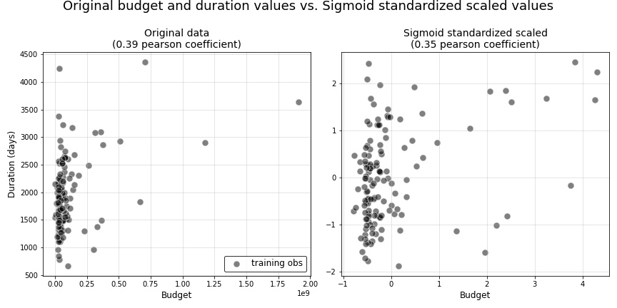
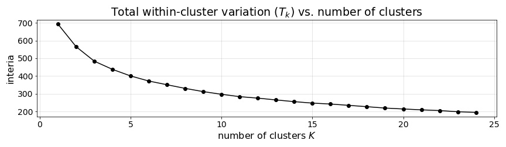
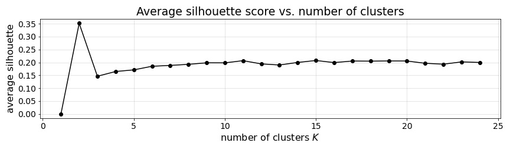
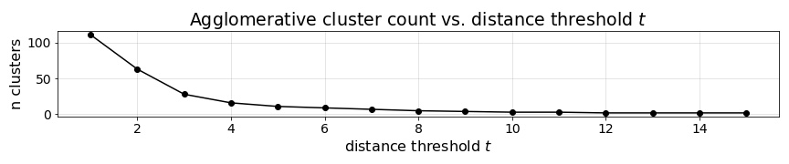
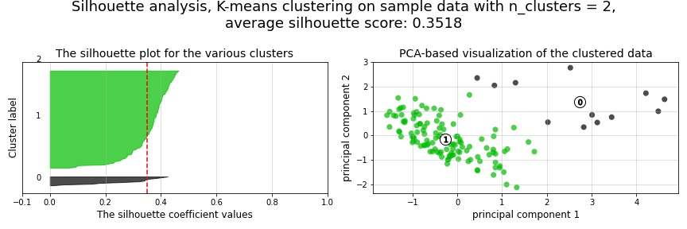

5. Reference class clustering
=============================

.. contents:: In this section
  :local:
  :depth: 1
  :backlinks: top

Methods used in this section
----------------------------

In the project management literature, particularly for academic research concerned with predicting project outcomes related to cost and duration overages, the concept of a project "reference class" is important to grouping like projects for the purpose of improved predictive accuracy. Due to the limitations of the categorical variables present in our current dataset, we have determined that, instead of using intuition or some predefined categorization of projects by type, we'd instead seek to algorithmically classify our projects. The objective we are seeking to accomplish, is to use all available types of quantitative and categorical data at the start of the project to identify some sort of "latent" reference class clusters derived from the totality of those features.

To accomplish this, we perform two competing approaches to clustering on our original feature data (being careful to use only features we would have access to when given a new project to predict). First we use a set of baseline clustering algorithms (K-means, DBSCAN, and Agglomerative Cluster with Wards Method) to generate an initial reference class feature for our training set.

Next, we seek to overcome some of the shortcomings of these methods by using Uniform Manifold Approximation and Projection (UMAP), combined with HDBSCAN, to generate a second competing set of reference classes. Ultimately, we will determine which, if either, of these engineered features improve the predictive accuracy of our regression models.

Now, let's get started prepping our data for use with K-means...

K-means clustering for reference class labels
---------------------------------------------

.. contents:: In this section
  :local:
  :depth: 2
  :backlinks: top

The unabridged notebook used to generate the findings in this section can be `found here on GitHub <https://github.com/sedelmeyer/nyc-capital-projects/blob/master/notebooks/03_kmeans_attribute_features.ipynb>`_.

Once we take care of the first steps of subsetting our data features to include only the predictive features we'd have available when encountering a new project, we need to one-hot-encode our categorical features ``Category``, ``Borough``, ``Managing_Agenct``, ``Client_Agency``, ``Phase_Start``, ``Budget_Start``, and ``Duration_Start``.

Now, with our categorical variable one-hot-encoded, we can take the next step of scaling our quantitative variables ``Budget_Start`` and ``Duration_Start``.

Scaling data to reduce skewness
^^^^^^^^^^^^^^^^^^^^^^^^^^^^^^^

Due to the heavily skewed nature of these features, their extremely different numerical scales, and the existence of exteme outliers, we will scale the data accordingly. To accomplish this, we first (1) standardize the data, we then (2) apply a sigmoid transformation to the standardized data to minimize the skew and impact of outliers, and we (3) then re-standardize the sigmoid transformed data to return it to a standard scale.

  Figure 14: Original training data versus data that has been standardized, sigmoid transformed, and then re-standardized

As can be seen in the two plots above, the 3-step scaling method we applied (standardize, sigmoid transform, and then re-standardize), as was described immediately above, does an adequate job of reducing (but not eliminating) the skew of our data and the magnitude out our outliers.

This we believe is an important first step before clustering, primarily to get all variables on a more common scale, so that the distance-based clustering algorithms used here are not overwhelmed by just the Budget_Start values, which range in the hundreds of millions of dollars.

K-means at various :math:`k` numbers of clusters
^^^^^^^^^^^^^^^^^^^^^^^^^^^^^^^^^^^^^^^^^^^^^^^^

With this scaling completed, we can now compare K-means at various values for :math:`k`.

  Figure 15: Within cluster variation versus number of K-means clusters

  Figure 16: Average silhouette score versus number of K-means clusters

.. figure:: ../../docs/_static/figures/17-kmeans-gapstat-lineplot.jpg
  :align: center
  :width: 100%

  Figure 17: Gap statistic versus number of K-means clusters

As is the problem with diagnostic metrics for evaluating K-means clustering, optimal values :math:`k` can be interpreted differently dependent on the metric and evaluative methods used.

For instance, in the inertia plot at the top above, it is rather unclear if any elbow exists in the line plot, althought careful inspection might indicate a slight visual kink at either 2 or 3 clusters.

Next, the average silhouette plot would indicate that 2 clusters are ideal if we are evaluating on average silhouette score alone.

Last, the Gap statistic plot indicates no conclusive result, as error bars overlap right from the start, but it does offer the intriguing feature that it jumps significantly at :math:`k=7`.

DBSCAN clustering comparison
^^^^^^^^^^^^^^^^^^^^^^^^^^^^

These inconclusive K-means results led us to next examine what kind of unsupervised clustering might be achieved using DBSCAN, where rather than selecting an optimal number of clusters explicitly, the algorithm would do that for us. 

.. figure:: ../../docs/_static/figures/18-dbscan-epsilon-lineplot.jpg
  :align: center
  :width: 100%

  Figure 18: Epsilon (i.e. 11 nearest neighbors distance) plotted by increasing observations

.. figure:: ../../docs/_static/figures/19-dbscan-cluster-barplot.jpg
  :align: center
  :width: 100%

  Figure 19: DBSCAN clustering results

For the DBSCAN model::

   DBSCAN(eps=2.25, min_samples=12):

       2 clusters were identified
       25 of the n=134 observations were not assigned a cluster
    
   The resulting silhouette score, excluding unclustered points:

       0.1843

The distribution of resulting labels are illustrated by this chart with un-clustered observations represented by the cluster labeled -1.

It was extremely difficult to find a set of parameters :math:`\epsilon` and ``min_samples`` that yeilded any sort of separation of our data into discrete clusers using DBSCAN.

Shown here was the most "reasonably separated" set of clusters we could achieve. Accoding to this we have 2 major clusters, one more heavily distributed with 94 observations, and a set of 25 observation not assigned to either category.

Agglomerative clustering comparison using Ward's method
^^^^^^^^^^^^^^^^^^^^^^^^^^^^^^^^^^^^^^^^^^^^^^^^^^^^^^^

As a final attempt to learn about the natural clustering of this data, we perform agglomerative clustering using Ward's method below, with the results plotted as a dendrogram.

.. figure:: ../../docs/_static/figures/20-wards-dendrogram.jpg
  :align: center
  :width: 100%

  Figure 20: Agglomerative clustering dendrogram

.. figure:: ../../docs/_static/figures/21-wards-silscore-lineplot.jpg
  :align: center
  :width: 100%

  Figure 21: Agglomerative cluster silhouette score by distance threshold :math:`t`

  Figure 22: Agglomerative cluster count by distance threshold :math:`t`

Here we can see how Ward's method identifies distances between observations with linkage points illustrated in the dendrogram above. Using this method, we can see the average silhouette score decrease as the distance threshold increases (the middle line plot), until it spikes at the last few threshold values :math:`t`. However, it is intersting to note just how quickly the number of clusters diminish as the threshold increases.

Overall, this method yields the highest average silhouette score at :math:`k=2` clusters.

K-means visual inspection and selection
^^^^^^^^^^^^^^^^^^^^^^^^^^^^^^^^^^^^^^^

Now that we are armed with this additional clustering information, we are going to inspect just a few sets of K-means clusters at a few values :math:`k` we think might be best suited to this data given our results above. Those will be :math:`k`'s of 2, 3, and 5.

  Figure 23: K-means :math:`k=2` clustering results

.. figure:: ../../docs/_static/figures/24-kmeans-3-silplot.jpg
  :align: center
  :width: 100%

  Figure 23: K-means :math:`k=3` clustering results

.. figure:: ../../docs/_static/figures/25-kmeans-5-silplot.jpg
  :align: center
  :width: 100%

  Figure 23: K-means :math:`k=5` clustering results

As can be seen in the silhouette analysis plots and 2-dimensional PCA representations above, all three values :math:`k` provide intriguing types of separation among our data. While we would have liked to incorporate K-means reference class classification features of several varying values :math:`k` in our engineered feature set for predictive comparisons in our regression models, we utlimately decided to choose just one K-means-derived reference class feature in favor of exploring other, more powerful clustering techniques as we illutrate below in section 3.1.2. In the end, we decided to balance clarity of separation as exhibited in the PCA plots above with a value :math:`k` which provided some degree of balance between the size and individual silhouette scores of several clusters. For that reason we choose :math:`k=3` for our eventual predictive reference class feature titled ``attributes_km3_label`` in our final model data.