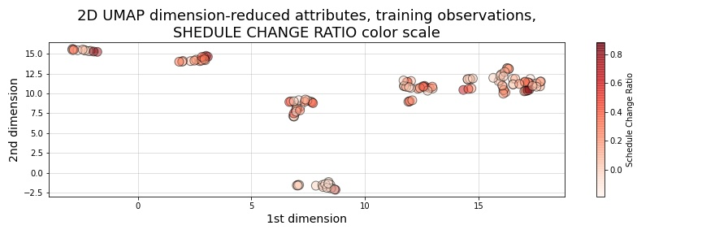
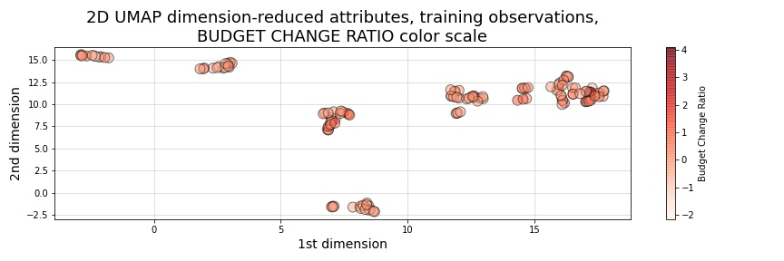
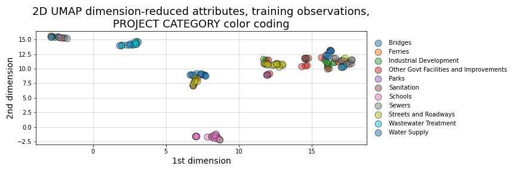
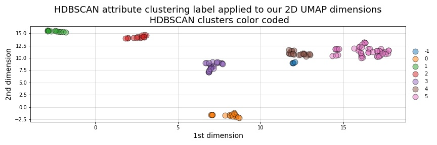
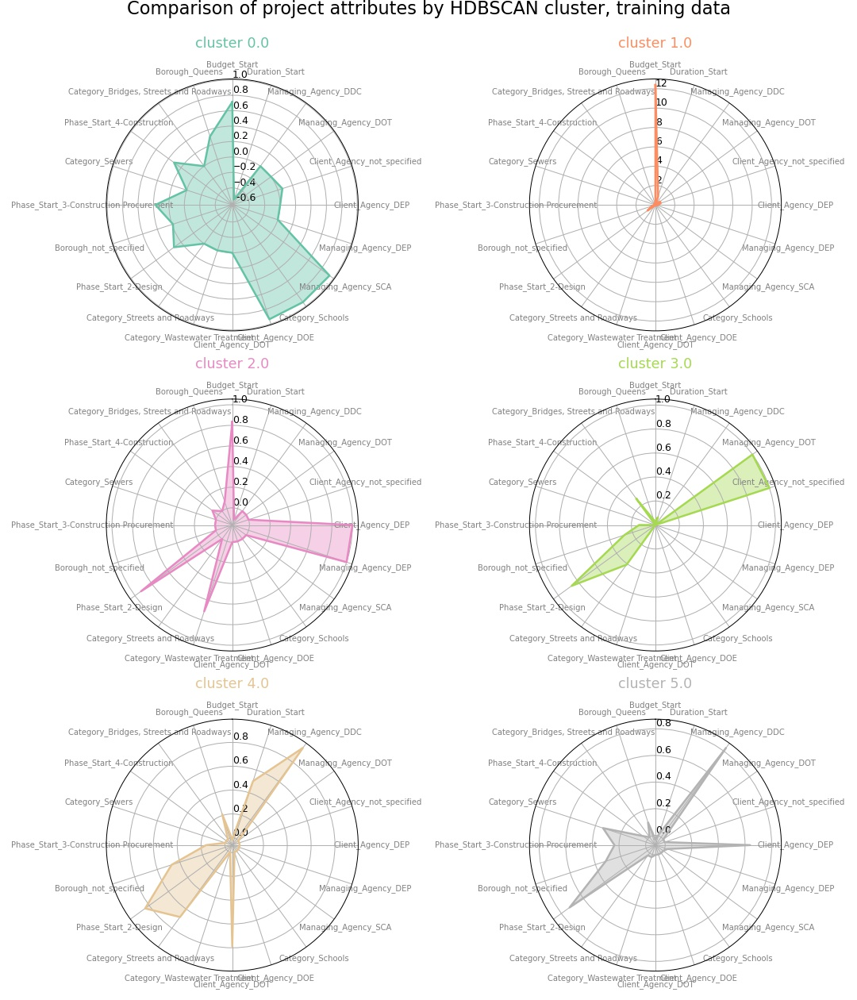
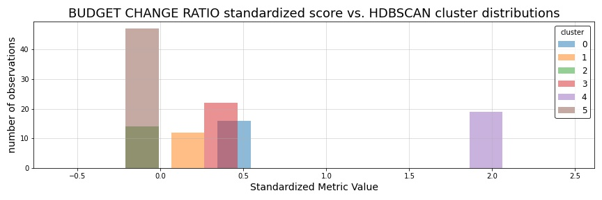
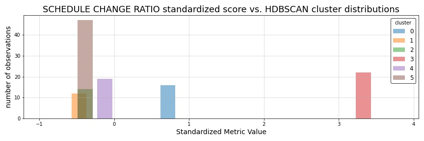

.. _cluster2:

6. Reference class clustering advanced methods
==============================================

.. contents:: In this section
  :local:
  :depth: 2
  :backlinks: top

Disadvantages of PCA, K-means, DBSCAN
-------------------------------------

Caveats of Kmeans K-Means is the "go-to" clustering algorithm for many simply because it is fast, easy to understand, and available everywhere. K-Means has a few problems however. The first is that it isn’t a clustering algorithm, it is a partitioning algorithm. That is to say K-means doesn’t "find clusters" it partitions your dataset into as many (assumed to be globular) chunks as you ask for by attempting to minimize intra-partition distances. Clusters found in kmeans are usually similar in shapes, with an assumption of largely spherical clusters.

Also, as we saw above, finding the optimum number of clusters can be challenging. The gap statistic and silhouette plots help, but finding the "elbow" was not too easy, nor does it necessarily correlate well with the number of natural clusters.

A competing approach using UMAP in combination with HDBSCAN
-----------------------------------------------------------

By using  HDBSCAN instead of the more standard DBSCAN, we can improve on our results by using a smarter density based algorithm. We chose HDBSCAN, which is an improved version of DBSCAN. Unlike DBSCAN, it allows variable density clusters. It also replaces the unintuitive epsilon parameter with a new parameter ``min_cluster_size``, which is used to determine whether points are "falling out of a cluster" or splitting to form two new clusters. HDBSCAN usually does very well with the points that it is confident enough to put into clusters, while leave out less confident points.

The need to use dimensionality reduction techniques in conjunction with HDBSCAN
-------------------------------------------------------------------------------

We used HDBSCAN on the raw, one-hot-encoded data and got between 70% - 80% of the data clustered. While HDBSCAN did a great job on the data it could cluster it did a poor job of actually managing to cluster the data. The problem here is that, as a density based clustering algorithm, HDBSCAN tends to suffer from the curse of dimensionality: high dimensional data requires more observed samples to produce much density. If we could reduce the dimensionality of the data more we would make the density more evident and make it far easier for HDBSCAN to cluster the data. The problem is that trying to use PCA to do this can be problematic due to its linear nature. What we need is strong manifold learning, which graph-based methods like t-sne and UMAP can offer. We chose UMAP since it is faster and preserves global structures better.

Our goal is to make use of **uniform manifold approximation and projection (UMAP)** to perform non-linear manifold aware dimension reduction so we can get the dataset down to a number of dimensions small enough for a density based clustering algorithm to make progress. UMAP constructs a high dimensional graph representation of the data, with edge weights representing the likelihood that two points are connected. It chooses whether one point is connected to another or not using a local radius metric, based on the distance to each point's nth nearest neighbor, then optimizes a low-dimensional graph to be as structurally similar as possible.

Tuning UMAP The most important parameter is ``n_neighbors`` - the number of approximate nearest neighbors used to construct the initial high-dimensional graph. It effectively controls how UMAP balances local versus global structure - low values will push UMAP to focus more on local structure by constraining the number of neighboring points considered when analyzing the data in high dimensions, while high values will push UMAP towards representing the big-picture structure while losing fine detail. As ``n_neighbors`` increases, UMAP connects more and more neighboring points when constructing the graph representation of the high-dimensional data, which leads to a projection that more accurately reflects the global structure of the data. At very low values, any notion of global structure is almost completely lost.

**Sources and additional resources:**

* https://pair-code.github.io/understanding-umap/
* https://umap-learn.readthedocs.io/en/latest/clustering.html
* https://hdbscan.readthedocs.io/en/latest/comparing_clustering_algorithms.html

Getting started
---------------

The unabridged notebook used to generate the findings in this section can be :notebooks:`found in Notebook 05 on GitHub <05_umap_hdbscan_features.ipynb>`.

To get started on this task, we trained UMAP transformer on the train set, and use that for getting 2D embedding from train data as additional features during training time. At inference time, we use the same transformer (fitted only on train) to transform the test set.

We can see from the visualizations below that the 2D embedding gives us some insight into our data. It shows separation between cluster of points, and their is some logic in the direction of the components with regards to our two target variable ``Budget_Change_Ratio`` and ``Schedule_Change_Ratio``.

.. _fig26:

   Figure 26: 2-dimensional UMAP reduction with ``Schedule_Change_Ratio`` color scale 

.. _fig27:

   Figure 27: 2-dimensional UMAP reduction with ``Budget_Change_Ratio`` color scale

.. _fig28:

   Figure 28: 2-dimensional UMAP reduction, color coded by project category

Clustering our UMAP projections
-------------------------------

After our initial dimensionality reduction with UMAP, we then applied HDBSCAN on the resulted UMAP embedding and got much better results than clustering on our raw data. HDBSCAN was able to cluster > 99% of points, and the clusters all contained multiple types of project categories (as can be seen by examining the clusters below and comparing them to the category-colored scatterplot of the UMAP embedding above). We interperet this to mean that we were able to capture more information in our would-be reference classes than we might otherwise have been able to capture by using the existing defined categories present in the original dataset.

.. _fig29:

   Figure 29: 2-dimensional UMAP reduction, color coded by HDBSCAN-assigned clusters

For comparison, the resulting average silhouette score for our two methods of reference class clustering, when measured against our original training data (without any feature engineering), are::

                         Silhouette Score
   K-means, k=3          0.1461
   UMAP with HDBSCAN     0.1798

As a point of comparison, now that we have a second set of reference classes to compete in our models against the [K-means cluster completed in section 3.1.1](#3.1.1.-K-means-clustering-for-reference-class-labels), we can most directly compare both sets of clustered reference classes by examining the average silhouette scores of those clusters on our original set of training data. As is shown in the output above, the UMAP with HDBSCAN method achieves a slightly higher avg. silhoutte score at 0.1798 than the K-means :math:`k=3` clusters, which scored 0.1461. While this might indicate better clustering using UMAP with HDBSCAN, the real test comes when we attempt to use each of theses engineered features in competing prediction models.

Understand characteristics of projects in each of our clustering labels:
------------------------------------------------------------------------

In our attempt to understand the 5 clusters/latent reference classes shown above, we used two approaches in our more complete notebook (which can be `found here <https://github.com/sedelmeyer/nyc-capital-projects/blob/master/notebooks/05_umap_hdbscan_features.ipynb>`_):

1. Fit 5 binary classification classifiers, each predicting the datapoints of one cluster vs the rest of the data

2. Select which variable has the highest variance between clusters, with the assumption that cluster-defining variables will have very different mean from one cluster to another.

However, since approach 2 yielded better results, for the sake of brevity, that is all we are showing below.

.. _fig30:

   Figure 30: Comparison of HDBSCAN cluster project attributes

By plotting the cluster-defining features onto radar plots, we can find intuitive explanations for each of the clusters. For example, cluster 5 are projects that are Managed by DDC, with DEP as Client agency. They are typically Sewers construction projects in Queens. Overall, we see an interesting mixing of each categorical variable within our clusters, indicating that our clustering algorithm did a good job separating projects along more than one set of dimensions, and may taken into account a set of latent relationships between all our available features, adding more richness than we might otherwise be able to do by explicitly assigning the reference classes ourselves.

Now, since our main goal is to use these reference classes to help improve our predictions, we visualize the histogram of projects Budget Change Ratio and Schedule Change Ratio, colored by clusters in the two plots below.

.. _fig31:

   Figure 31: HDBSCAN clustering compared to ``Budget_Change_Ratio`` standardized values

.. _fig32:

   Figure 32: HDBSCAN clustering compared to ``Schedule_Change_Ratio`` standardized values

Based on these histograms, we can see that there are decent separation among our clusters in both of our response variable dimensions, ``Budget_Change_Ratio`` and ``Schedule_Change_Ratio``. The clustering labels as a feature may perhaps help us most in predicting outlier values (as evidenced by the separation of cluster 4 in ``Budget_Change_Ratio`` and cluster 3 in ``Schedule_Change_Ratio``) and may even help to distinguishing a set of other obervations from one another in our regressor models, except in areas of heavily overlapping clusters (e.g. clusters 2 and 5)

Clustering conclusions
----------------------

Now that we feel we have created a two sufficient sets of competing reference classes to test within our models, we move on the embedding the textual project-description data available in our data set.

.. _resources06:

Additional resources
--------------------

Below are some additional resources on the methods used in this section of the analysis.

**Density-based spatial clustering of applications with noise (DBSCAN)**

* :ref:`For additional background on DBSCAN, please see the resources listed in Section 05 of this analysis <ref-dbscan>`. 

.. _ref-hdbscan:

**Hierarchical density-based spatial clustering of applications with noise (HDBSCAN)**

* `The original paper introducing the principles of HDBSCAN by Campello, Moulavi, and Sander <hdbscan-paper1_>`_:

  * Campello, R.J.G.B.; Moulavi, Davoud; Sander, Joerg (2013). "Density-Based Clustering Based on Hierarchical Density Estimates". In: Pei J., Tseng V.S., Cao L., Motoda H., Xu G. (eds) Advances in Knowledge Discovery and Data Mining. PAKDD 2013. Lecture Notes in Computer Science, vol 7819. Springer, Berlin, Heidelberg. `DOI:10.1007/978-3-642-37456-2_14 <hdbscan-paper1_>`_.

* `The original paper introducing the accelerated algorithm for performing HDBSCAN by McInnes and Healy <hdbscan-paper2_>`_:

  * McInnes, Leland; Healy, John (2017). "Accelerated Hierarchical Density Clustering". IEEE International Conference on Data Mining Workshops (ICDMW), 2017: 33-42. `arXiv:1705.07321v2 <hdbscan-paper2_>`_.

* `The Python implementation of HDBSCAN used in this analysis and described in the McInnes and Healy paper listed above <hdbscan-lib_>`_:

  * McInnes, Leland; contributors (2020). "hdbscan". GitHub repository, A high performance implementation of HDBSCAN clustering, v0.8.26. `https://github.com/scikit-learn-contrib/hdbscan <hdbscan-lib_>`_. 

* `An illustrated overview of how the HDBSCAN clustering algorithms works <hdbscan-how_>`_:

  * McInnes, Leland; contributors (2016). "How HDBSCAN Works". Read the Docs, The hdbscan Clustering Library. `https://hdbscan.readthedocs.io/en/latest/how_hdbscan_works.html <hdbscan-how_>`_. (Accessed August 18, 2020)

* `A comparison of HDBSCAN versus other clustering algorithm <hdbscan-comp_>`_:

  * McInnes, Leland; contributors (2016). "Comparing Python Clustering Algorithms". Read the Docs, The hdbscan Clustering Library. `https://hdbscan.readthedocs.io/en/latest/comparing_clustering_algorithms.html <hdbscan-comp_>`_. (Accessed August 18, 2020)

**K-means clustering**

* :ref:`For additional background on the K-means algorithm, please see the resources listed in Section 05 of this analysis <ref-kmeans>`.

.. _ref-umap:

**Uniform manifold approximation and projection (UMAP)**

* `A very well designed demo illustrating the results of UMAP and comparing them to comparable t-SNE results <umap-demo_>`_:

  * Coenen, Andy; Pearce, Adam (2018). "Understanding UMAP". Google PAIR. `https://pair-code.github.io/understanding-umap/ <umap-demo_>`_. (Accessed August 18, 2020)

* `The original paper introducing UMAP by McInnes, Healy, and Melville <umap-paper_>`_:

  * McInnes, Leland; Healy, John; Melville, James (2018). "UMAP: Uniform Manifold Approximation and Projection for Dimension Reduction". ArXiv e-prints. `arXiv:1802.03426v2 <umap-paper_>`_.

* `The Python implementation of UMAP (i.e. umap-learn) used in this analysis and described in the paper listed above <umap-lib_>`_:

  * McInnes, Leland; contributors (2020). "umap". GitHub repository, Uniform Manifold Approximation and Projection, v0.4.5. `https://github.com/lmcinnes/umap <umap-lib_>`_. 

* `A section of the umap-learn library documentation discussing the use of UMAP to improve clustering results <umap-cluster_>`_:

  * McInnes, Leland; contributors (2018). "Using UMAP for Clustering". Read the Docs, UMAP: Uniform Manifold Approximation and Projection for Dimension Reduction. `https://umap-learn.readthedocs.io/en/latest/clustering.html <umap-cluster_>`_. (Accessed August 18, 2020)

.. _hdbscan-paper1: https://doi.org/10.1007/978-3-642-37456-2_14

.. _hdbscan-paper2: https://arxiv.org/abs/1705.07321v2

.. _hdbscan-lib: https://github.com/scikit-learn-contrib/hdbscan

.. _hdbscan-comp: https://hdbscan.readthedocs.io/en/latest/comparing_clustering_algorithms.html

.. _hdbscan-how: https://hdbscan.readthedocs.io/en/latest/how_hdbscan_works.html

.. _umap-paper: https://arxiv.org/abs/1802.03426v2

.. _umap-lib: https://github.com/lmcinnes/umap

.. _umap-cluster: https://umap-learn.readthedocs.io/en/latest/clustering.html

.. _umap-demo: https://pair-code.github.io/understanding-umap/