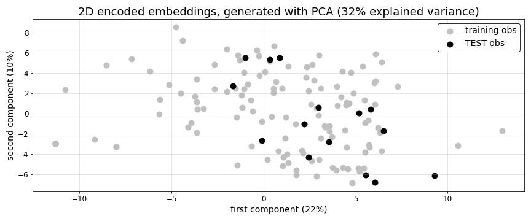
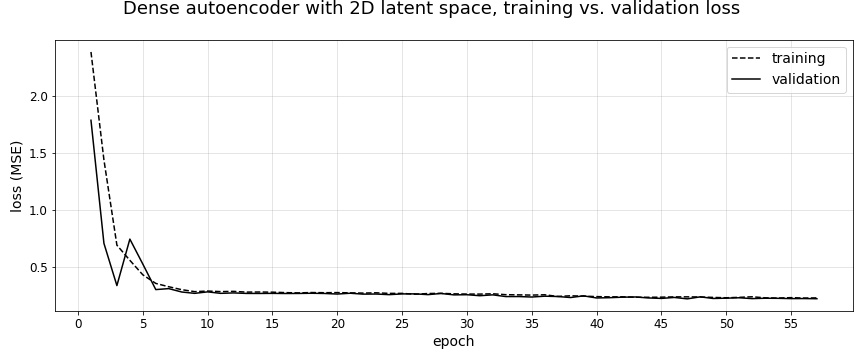
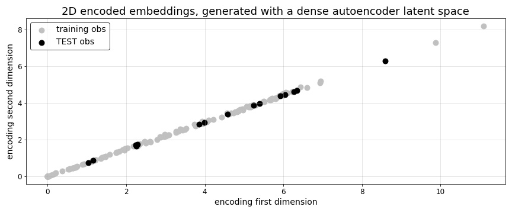
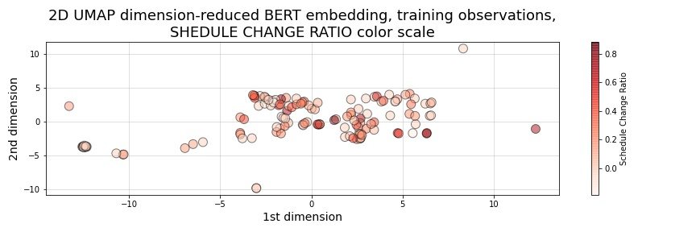
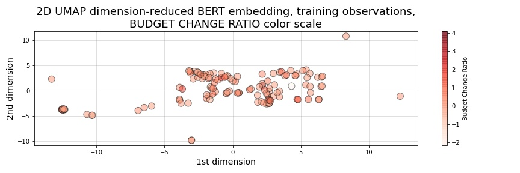
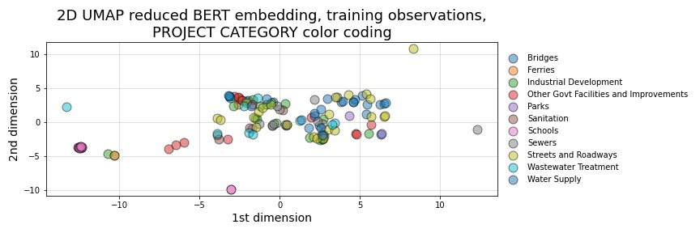
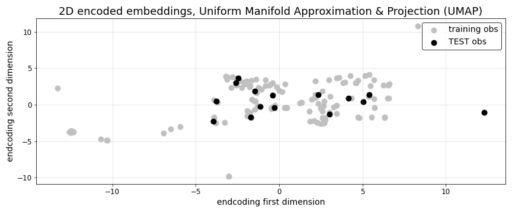

6. BERT embedded project descriptions
=====================================

.. contents:: In this section
  :local:
  :depth: 1
  :backlinks: top

Embedding project descriptions text with BERT
---------------------------------------------

The unabridged notebook used to generate the findings in this section can be `found here on GitHub <https://github.com/sedelmeyer/nyc-capital-projects/blob/master/notebooks/02_bert_embedded_descriptions.ipynb>`_.

.. contents:: In this section
  :local:
  :depth: 2
  :backlinks: top

Here, the objective is to create an embedding from the project descriptions for each project in our dataset.  We won't be making predictions based directly on the full embedding of each descriptions. Because our resulting embedding for each project description will be 512 values in length (the shortest available pre-trained BERT embedding), this would introduce far too many additional features into our predictor set to be of use for such a small training dataset. Instead, we will be extracting the latent space that these BERT embeddings provide via several different dimensionality reduction methods described below in sections [3.3.1 (PCA)](#3.3.1.-PCA-dimension-reduced-encoding-of-BERT-embedded-text), [3.3.2 (dense autoencoder)](#3.3.2.-Autoencoder-dimension-reduced-encoding-of-BERT-embedded-text), and [3.3.3 (uniform manifold approximation and projection, or UMAP for short)](#3.3.3.-UMAP-dimension-reduced-encoding-of-BERT-embedded-text).  Our resulting demensionality reduced description embeddings will be limited to 2 dimensions each to limit model complexity.  If we find that any of the 2-dimensional description embeddings prove useful in our models, it may be useful to explore using a larger-dimension latent space in the future.

For our embedding exercise, BERT was chosen because it is currently a leading NLP model and has a bi-directional character which should allow the resulting embedding to take into account more expressive sequential relationships among words in each description.

Citation
^^^^^^^^

For additional information on the pre-trained BERT model used in this analysis, please see the original project's source repository:

- https://github.com/google-research/bert

The specific pre-trained BERT model used here, ``uncased_L-2_H-128_A-2``, was downloaded from:

- https://storage.googleapis.com/bert_models/2020_02_20/uncased_L-2_H-128_A-2.zip

Additionally, this pre-trained model is referenced by its author's in the following article:

- Turc, Iulia and Chang, Ming-Wei and Lee, Kenton and Toutanova, Kristina. (2019). "Well-Read Students Learn Better: On the Importance of Pre-training Compact Models". `arXiv preprint arXiv:1908.08962v2 <https://arxiv.org/abs/1908.08962>`_.

And, more information regarding BERT itself can be found in the original paper:

- Devlin, Jacob and Chang, Ming-Wei and Lee, Kenton and Toutanova, Kristina. (2018). "BERT: Pre-training of Deep Bidirectional Transformers for Language Understanding". `arXiv preprint arXiv:1810.04805 <https://arxiv.org/abs/1810.04805>`_.

BERT embedding summary result
^^^^^^^^^^^^^^^^^^^^^^^^^^^^^

The resulting shapes of the train and test bert embeddings arrays are::

   Train    (134, 512)
   TEST     (15, 512)

The length of each project's description-text embedding is an array of n=512 float values

For all 68,608 embedding values used to describe our description text for the TRAINING set, these are the basic summary statistics::

   min      -6.9
   max      5.6
   mean     0.67
   std	    1.2

As can be seen by the printed summary output above, the resulting BERT embeddings for each observation resulted in the expected array of 512 float values. Now, by subsetting our embeddings to match the projects contained in our training and test sets, we are able to train different dimensionality-reduction methods on our training set to generate a set of 2-dimensional training embeddings. We can then use those fitted models predict our test (or previously unseen) embeddings for use in evaluating our eventual "project success" prediction models.

In the next section below (Section 3.3), we examine 3 competing methods for reducing the dimensions of our 512-dimension description-text BERT embeddings to just 2 dimensions each.

Encoding the BERT embedding with PCA, Autoencoders, and UMAP
------------------------------------------------------------

.. contents:: In this section
  :local:
  :depth: 2
  :backlinks: top

As described above in the previous section, Section 3.3. of our analysis focuses on 3 competing methods for reducing the dimensions of our 512-dimension BERT embeddings. The objective of these reduced-dimension embeddings will be to reduce our current BERT embeddings to just 2 values each. If we are able to effectively accomplish this, we will have reduced 512 possible predictors to just 2, minimizing the added complexity to our "project success" prediction models. The challenge here though, will be to reduce this dimensionality in such a way that we retain as much explained variance in our embeddings as possible, but in a greatly reduced dimension-space. As can be seen in the "IN THIS SECTION" list above, **we will explore principal component analysis (PCA), "latent space" encoding with a dense autoencoder neural network, and uniform manifold approximation and projection (UMAP) as our methods of choice.**

PCA dimension-reduced encoding of BERT embedded text
^^^^^^^^^^^^^^^^^^^^^^^^^^^^^^^^^^^^^^^^^^^^^^^^^^^^

The unabridged notebook used to generate the findings in this section can be `found here on GitHub <https://github.com/sedelmeyer/nyc-capital-projects/blob/master/notebooks/04_pca_autoencoder_features.ipynb>`_.

Here we start with PCA as our first method for reducing the dimensions of our BERT embeddings.

* Please note, given the random seed we use in our algorithm below, the resulting PCA components generated for both train and test will be perfectly identical to the values present in the train and test dataframes we have already loaded from disk. Those values can be access in the train and test columns titled ``pca_descr_embed_1`` and ``pca_descr_embed_2``

* Also, note we are training our PCA algorithm only on our training data, therefore treating our test data as "unseen" or new data against with we apply the fitted model to generate components as we would when new project observations are acquired.

* Lastly, note that, because the BERT embeddings are all of the same units of measure, we have choosen not to standardize our BERT embeddings data prior to fitting our PCA decomposition model.

   Figure 33: PCA decomposition fitted on training data embeddings

.. code-block:: Bash

   Total variance explained by the first 2 PCA components

   31.64%

As can be seen in the output above, the first 2 principle components for our PCA model fitted on our training set comprises :math:`31.64\%` of the explained variance in our 512-dimension dataset of BERT embeddings. This result strikes us as particularly promising given the high degree to which we have reduced the dimensionalty of this data. However, the true test of this method will be whether or not these 2 dimensions, when incorporated as predictors for one of our prediction models, will yield us improved predictive behavior in our models.

Now, with PCA taken care of, we move on to our next competing method for reducing the dimensionality of our BERT embeddings: "latent space" encoding with a dense autoencoder neural network.

Autoencoder dimension-reduced encoding of BERT embedded text
^^^^^^^^^^^^^^^^^^^^^^^^^^^^^^^^^^^^^^^^^^^^^^^^^^^^^^^^^^^^

The unabridged notebook used to generate the findings in this section can be `found here on GitHub <https://github.com/sedelmeyer/nyc-capital-projects/blob/master/notebooks/04_pca_autoencoder_features.ipynb>`_.

In this section, we apply a dense autoencoder neural network to generate an encoded (and learned) 2-dimensional latent space (i.e. 2-dimensional bottleneck) with which we can encode our 512-dimension BERT embeddings to just 2 dimensions.

Because of the difficulty associated with trying to perfectly replicate our original results of this autoencoder network in this report notebook `the original of which [can be seen on GitHub at this location <https://github.com/sedelmeyer/nyc-capital-projects/blob/master/notebooks/04_pca_autoencoder_features.ipynb>`_), we will:

1. Call the same custom function used to generate the architecture and compile that original model for illustrative purposes.

2. Load and plot the training history of that originally trained model.

3. Plot the 2-dimensional latent space of that original autoencoder, which can be visualized by plotting the original values saved to our current train and test sets under the columns titled  ``ae_descr_embed_1`` and ``ae_descr_embed_2``.

About the network architecture
""""""""""""""""""""""""""""""

Now we first replicate the architecture of our originally trained model, as is shown below, and load a pickled Python dictionary containing the original training loss values at the end of each trained epoch.

.. code-block::

    THE ENCODER MODEL:

    Model: "ae_2dim_encoder"
    _________________________________________________________________
    Layer (type)                 Output Shape              Param #   
    =================================================================
    input_1 (InputLayer)         [(None, 512)]             0         
    _________________________________________________________________
    dense (Dense)                (None, 512)               262656    
    _________________________________________________________________
    dropout (Dropout)            (None, 512)               0         
    _________________________________________________________________
    dense_1 (Dense)              (None, 128)               65664     
    _________________________________________________________________
    dropout_1 (Dropout)          (None, 128)               0         
    _________________________________________________________________
    dense_2 (Dense)              (None, 32)                4128      
    _________________________________________________________________
    dropout_2 (Dropout)          (None, 32)                0         
    _________________________________________________________________
    dense_3 (Dense)              (None, 8)                 264       
    _________________________________________________________________
    dropout_3 (Dropout)          (None, 8)                 0         
    _________________________________________________________________
    dense_4 (Dense)              (None, 2)                 18        
    =================================================================
    Total params: 332,730
    Trainable params: 332,730
    Non-trainable params: 0
    _________________________________________________________________

    THE DECODER MODEL:

    Model: "ae_2dim_decoder"
    _________________________________________________________________
    Layer (type)                 Output Shape              Param #   
    =================================================================
    input_2 (InputLayer)         [(None, 2)]               0         
    _________________________________________________________________
    dense_5 (Dense)              (None, 8)                 24        
    _________________________________________________________________
    dropout_4 (Dropout)          (None, 8)                 0         
    _________________________________________________________________
    dense_6 (Dense)              (None, 32)                288       
    _________________________________________________________________
    dropout_5 (Dropout)          (None, 32)                0         
    _________________________________________________________________
    dense_7 (Dense)              (None, 128)               4224      
    _________________________________________________________________
    dropout_6 (Dropout)          (None, 128)               0         
    _________________________________________________________________
    dense_8 (Dense)              (None, 512)               66048     
    _________________________________________________________________
    dropout_7 (Dropout)          (None, 512)               0         
    _________________________________________________________________
    dense_9 (Dense)              (None, 512)               262656    
    =================================================================
    Total params: 333,240
    Trainable params: 333,240
    Non-trainable params: 0
    _________________________________________________________________

    THE AUTOENCODER (AE) MODEL:

    Model: "ae_2dim"
    _________________________________________________________________
    Layer (type)                 Output Shape              Param #   
    =================================================================
    ae_2dim_encoder (Model)      (None, 2)                 332730    
    _________________________________________________________________
    ae_2dim_decoder (Model)      (None, 512)               333240    
    =================================================================
    Total params: 665,970
    Trainable params: 665,970
    Non-trainable params: 0
    _________________________________________________________________

As can be seen in the printed model summaries above, our full dense autoencoder network is actually a composition of two separate models. The first model, which takes the original 512 BERT embeddings values as input is our "Encoder" model. That encoder model reduces the dimensions of our embeddings incrementally by passing those embeddings through 5 dense layers, each of which becomes incrementally smaller (with fewer output nodes), until it reduces to a 2-dimensional bottleneck. The Encoder model output at this bottleneck can be thought of as the 2-dimensional latent spaced learned by our network to represent the encoded distribution of these BERT training embeddings. Then, the output from the Encoder model becomes the input for the Decoder model, which works the same process with 5 additional dense layers, but in reverse order. Ultimately decoding our 2-dimensional encoded BERT embeddings back to their original dimension.

In between each dense layer of the Encoder and Decoder networks are dropout layers, with dropout rates set to 0.20. The rationale for including these dropout layers is to try to prevent our network from memorizing the the training set, thus hopefully helping the autoencoder to generalize to the new "unseen" embeddings which it will ultimately encounter in our test set. While our inclination was to increase the dropout rate further for these layers, we ultimately kept it at 0.20 due to some interesting behaviour in our encoded latent space, which we will explore with the accompanying scatterplot shown below.

Lastly, our complete autoencoder model was compiled using Adam with a learning rate of 0.005 as our optimizer and mean squared error as our reconstruction loss becuase of the continuous values we are seeking to encode and decode with our network.

How the model was trained
"""""""""""""""""""""""""

   Figure 34: Autencoder mean-squared-error training history

Training summary::

   The network trained for 57 epochs achieving a minimum
   training loss of 0.223 and validation loss of 0.216

The resulting autoencoder model was trained for a maximum of 200 epochs, but with an early-stopping callback that monitored validation loss for a minimum change of at least a 0.0001 improvement to MSE within every 10 epochs (i.e. ``min_delta=0.0001`` and ``patience=10``). The callback also specified that the "best weights" be restored at the end of training. Therefore, because the early stopping parameters were triggered, the network only trained for 57 epochs, with the best training loss of :math:`MSE=0.223` and best validation loss of :math:`MSE=0.216`.

   Figure 35: Autencoder 2-dimensional encoded BERT embedding latent space

As can be seen above, after passing our training and test data into the Encoder portion of our autoencoder, the 2-dimensional encoded output indicates the dimensions of our encoded latent space are highly correlated. This is an interesting result. As I mentioned previously, we limited the dropout rate of the dropout layers in our autoencoder to a proportion lower than we might have otherwise chosen. This was primarily due to the increasingly correlated results we began to see as we continued to increase the dropout rate. Without dropout our latent space still exihibited some degree of correlation, albeit with the training and test observations far less tightly clusted along the diagonal axis. While we are not entirely certain of what to make of this counterintuitive result, we ultimately decided to walk a middle road where we kept our dropout rate lower than we might otherwise had, but still high enough that we felt we were sufficiently protecting against complete memorization of our training set.

The ultimate measure for us of how successful this attempt at dimensionality reduction is, comes later when we eventual fit these resulting 2 features as predictors in our prediction models and determine whether or not they increase the predictive strength of our model.

UMAP dimension-reduced encoding of BERT embedded text
^^^^^^^^^^^^^^^^^^^^^^^^^^^^^^^^^^^^^^^^^^^^^^^^^^^^^

The unabridged notebook used to generate the findings in this section can be `found here on GitHub <https://github.com/sedelmeyer/nyc-capital-projects/blob/master/notebooks/05_umap_hdbscan_features.ipynb>`_.

Now, as one final competing attempt at reducing the dimensions of our 512-dimension BERT embeddings to just 2 dimensions for our models, we will once again apply the UMAP algorithm previously used in conjunction with HDBSCAN for algorithmically identifying project reference classes. This time however, instead of categorizing our resulting UMAP encoded space, we will instead just directly use that 2-dimensional space as our dimensionality-reduced BERT emeddings similar to what we did with PCA and the dense autoencoder network above.

   Figure 36: 2-dimensional UMAP-reduced BERT embeddings with ``Schedule_Change_Ratio`` color scale

   Figure 37: 2-dimensional UMAP-reduced BERT embeddings with ``Budget_Change_Ratio`` color scale

   Figure 38: 2-dimensional UMAP-reduced BERT embeddings, color coded by project category

   Figure 39: UMAP 2-dimensional encoded BERT embedding latent space

As a common point of comparison with our prior UMAP plots, we once again see a heavy mixing of project ``Category``, as well as ``Budget_Change_Ratio`` and ``Schedule_Change_Ratio`` in our 2-dimensional UMAP encode space. And, ultimately, generating a train and test scatterplot similar to the ones we did for our 2D PCA and autoencoder encoded dimensions, we can see yet again another very different low-dimensionality representation of our 512 dimension BERT embeddings.

As mentioned before, whether or not these 2 dimensions help in the predictive power of our resulting prediction models will be the true test of whether or not this engineered feature was a success.