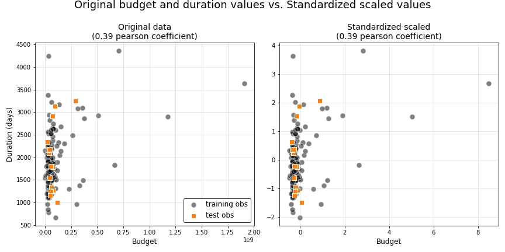
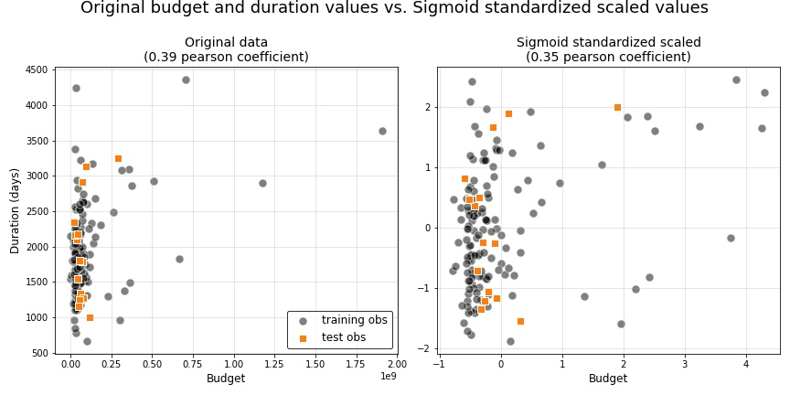
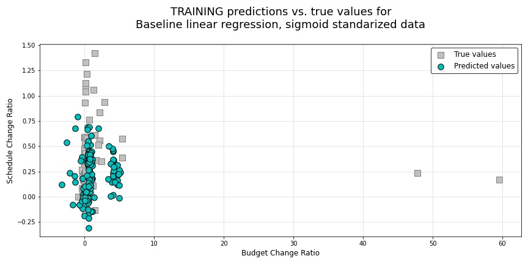
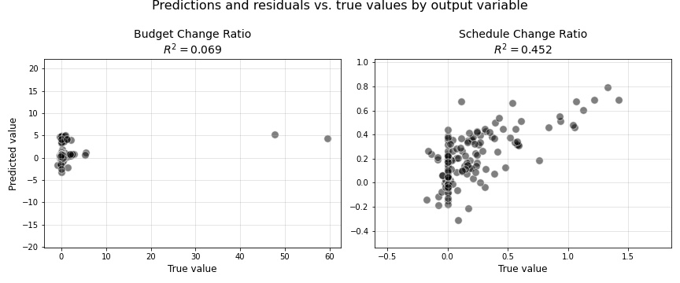
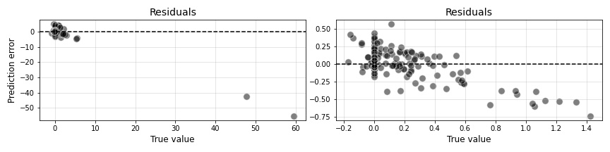
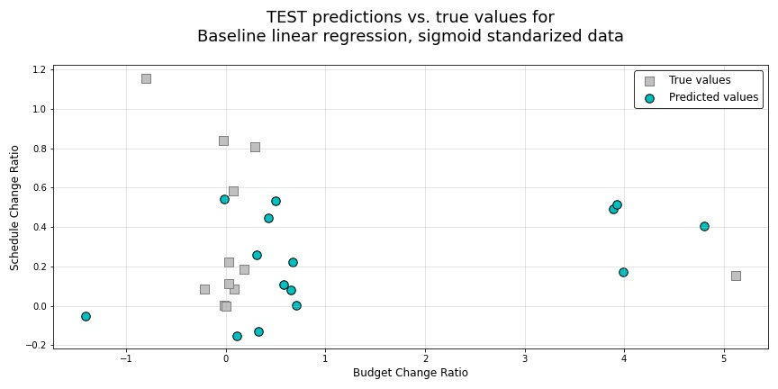
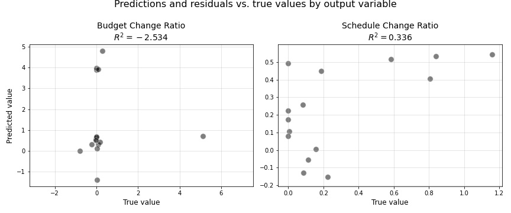
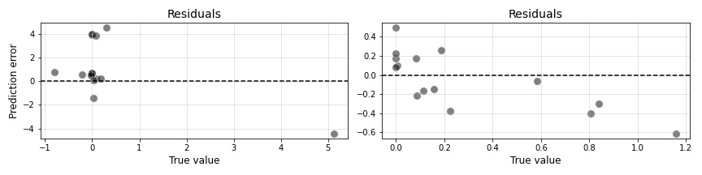
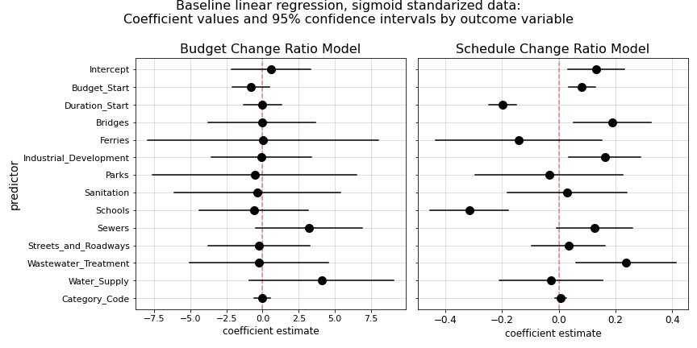

7. Generate a baseline linear model
===================================

.. contents:: In this section
  :local:
  :depth: 1
  :backlinks: top

In this section, prior to attempting to fit any complex models utilizing our newly engineered features, we first set a simple baseline against which we can compare all subsequent models. This will allow us to intelligently build complexity into our models, and it will allow us to hopefully develop a deeper sense of the predictive modelling problem we are trying to solve.

**For this Baseline model, we will utilize simple linear regression, using only the original features present in our initial dataset (prior to feature engineering).**

Available predictors and response variables
-------------------------------------------

But, before getting started with our model, we need to first pre-process our data by subsetting the ``X`` and ``y`` variables in our training and test datasets, and then we perform some initial scaling to address the skewness of our quantitative predictors ``Budget_Start`` and ``Duration_Start``. 

**For the reader's reference,** the following output illustrates the entire feature-space available to us in all of the modelling methods explored in the remainder of this report. This output includes our available predictors in the initial list of features, and our two response variables in the second printed list::

    AVAILABLE PREDICTORS:

    RangeIndex: 134 entries, 0 to 133
    Data columns (total 23 columns):
    #   Column                      Non-Null Count  Dtype  
    --  ------                      --------------  -----  
    0   Budget_Start                134 non-null    float64
    1   Duration_Start              134 non-null    int64  
    2   Bridges                     134 non-null    int64  
    3   Ferries                     134 non-null    int64  
    4   Industrial_Development      134 non-null    int64  
    5   Parks                       134 non-null    int64  
    6   Sanitation                  134 non-null    int64  
    7   Schools                     134 non-null    int64  
    8   Sewers                      134 non-null    int64  
    9   Streets_and_Roadways        134 non-null    int64  
    10  Wastewater_Treatment        134 non-null    int64  
    11  Water_Supply                134 non-null    int64  
    12  Category_Code               134 non-null    int64  
    13  umap_descr_2D_embed_1       134 non-null    float64
    14  umap_descr_2D_embed_2       134 non-null    float64
    15  umap_attributes_2D_embed_1  134 non-null    float64
    16  umap_attributes_2D_embed_2  134 non-null    float64
    17  attribute_clustering_label  134 non-null    int64  
    18  ae_descr_embed_1            134 non-null    float64
    19  ae_descr_embed_2            134 non-null    float64
    20  pca_descr_embed_1           134 non-null    float64
    21  pca_descr_embed_2           134 non-null    float64
    22  attribute_km3_label         134 non-null    int64

    RESPONSE VARIABLES:

    RangeIndex: 134 entries, 0 to 133
    Data columns (total 2 columns):
    #   Column                 Non-Null Count  Dtype  
    --  ------                 --------------  -----  
    0   Budget_Change_Ratio    134 non-null    float64
    1   Schedule_Change_Ratio  134 non-null    float64

Scaling method used for the linear models in this report
--------------------------------------------------------

Next, now that we have subsetted all available ``X`` and ``y`` variables into separate train and test dataframes, we need to perform scaling on our quantitative predictors.

   Figure 40: Standardized ``Budget_Start`` and ``Duration_Start`` data versus original unscaled values

   Figure 41: Sigmoid standardized ``Budget_Start`` and ``Duration_Start`` data versus original unscaled values

By visualizing our ``Budget_Start`` and ``Duration_Start`` predictors above, we can see a large skew with clear outliers in the original unscaled data. By applying standardization to the these predictors, as we have illustrated in the upper righthand plot, we have set both variables to the same scale. However, standardizing has not alleviated the skewness of our data or helped with our outlying datapoints. 

Therefore, we have also applied a sigmoid transformation to the data and re-standardized, as is shown in the lower righthand plot. This sigmoid transformation has helped to alleviate the skew of our data, and it has also helped to more evenly distrubute all of our data points, drawing outliers far closer to the center of the distribution.

**ADD MATHEMATICAL REPRESENTAITON OF STANDARDIZED AND SIGMOID STANDARDIZED SCALING**

Although we built our first sets of baseline models in our unabridge notebook from which this code was taken using first standard-scaled data and then eventually data scaled using the 3-step scheme described above (1.standardized, 2. sigmoid transform, then 3. re-standardize), for the sake of brevity, we will only illustrate results from the 3-step scaled data here in our baseline model results.

Baseline linear regression
--------------------------

The unabridged notebook used to generate the findings in this section can be `found here on GitHub <https://github.com/sedelmeyer/nyc-capital-projects/blob/master/notebooks/07_baseline_linear_models.ipynb>`_.

.. contents:: In this section
  :local:
  :depth: 2
  :backlinks: top

Fit the model
^^^^^^^^^^^^^

Now we will fit a "Baseline" linear regression model on our scaled datasets using the predictors ``Budget_Start``, ``Schedule_Start``, and one-hot-encoded ``Category`` values to set a baseline $R^2$ for evaluating future models::

    This "BASELINE" model uses the following predictors:

        ['Budget_Start', 'Duration_Start', 'Bridges', 'Ferries', 
        'Industrial_Development', 'Parks', 'Sanitation', 'Schools', 
        'Sewers', 'Streets_and_Roadways', 'Wastewater_Treatment', 
        'Water_Supply', 'Category_Code']

    MODEL SUMMARY:
    Baseline linear regression, sigmoid standarized data

    The fitted model object(s):

        <statsmodels.regression.linear_model.RegressionResultsWrapper
        object at 0x7f6bbc017dd0>

        <statsmodels.regression.linear_model.RegressionResultsWrapper
        object at 0x7f6bb44febd0>

    The formula for each fitted model object:

        Budget_Change_Ratio ~ Budget_Start + Duration_Start + 
        Bridges + Ferries + Industrial_Development + Parks + 
        Sanitation + Schools + Sewers + Streets_and_Roadways 
        + Wastewater_Treatment + Water_Supply + Category_Code

        Schedule_Change_Ratio ~ Budget_Start + Duration_Start +
        Bridges + Ferries + Industrial_Development + Parks + 
        Sanitation + Schools + Sewers + Streets_and_Roadways + 
        Wastewater_Treatment + Water_Supply + Category_Code

    This model resulted in the following R-squared scores:

        Budget_Change_Ratio

            Training    0.0686
            Test        -2.5340

        Schedule_Change_Ratio

            Training    0.4523
            Test        0.3364
        
Based on these initial results above ``Budget_Change_Ratio`` may prove more difficult to predict than ``Schedule_Change_Ratio``, wherein our predictions for ``Budget_Change_Ratio`` perform less well than a naive model as is indicated by the negative :math:`R^2` score for the test data.

While our test :math:`R^2` score for ``Schedule_Change_Ratio`` is much better than budget, it is still something we are going to seek to improve on in more complex models.

These results indicates to us that we will likely have more difficulty in predicting ``Budget_Change_Ratio`` in our future models and that a Linear Regression model likely lacks the expressiveness required to adequately fit a model to the underlying relationship between predictors and outcome variable.

Visualize Baseline Model predictions and coefficients
^^^^^^^^^^^^^^^^^^^^^^^^^^^^^^^^^^^^^^^^^^^^^^^^^^^^^

As on last step before moving on from Linear Regression, we will quickly inspect the predictions made by our **Baseline** model, as well as the regression coefficients.

   Figure 42: Baseline linear regression training predictions versus true values

   Figure 43: Baseline linear regression test predictions versus true values

As can be seen in the scatterplots above, if we look at the first set of subplots showing true training values for ``Budget_Change_Ratio`` and ``Schedule_Change_Ratio`` versus our training predictions, we can see a model that clusters predictions very close together and mildly deviates rightward toward the extreme ``Budget_Change_Ratio`` outliers. What's more we can see fundamental linear regression model assumptions being violated, particularly that our residuals are not uniformly distributed and that there is heteroscedasticity present in our data, as evidenced by the residual plots for each response variable.

Then, if we look at the second set of subplots, which illustrate the same results, but for the true versus predicted TEST data, we can see the same issues arising, as well as a larger than appropriate grouping of predictions being pulled rightward by the skewed values in our training set, against which this linear model was fitted.

As a last step in evaluating this baseline model, let's take a look at our resulting model coefficients.

   Figure 44: Baseline linear regression coefficients

Lastly, by inspecting our model coefficients, we can finish our analysis of the baseline linear model. By looking at the ``Budget_Change_Ratio`` coefficient estimates and :math:`95\%` confidence intervals for each of those estimates, we can see that the model does not identify one single significant coefficient, as is evidenced by the confidence bounds all overlapping the value :math:`0`. Considering that the test :math:`R^2` score for that model was :math:`-2.53`, these coefficients are not surprising. If anything, they help to illustrate just how much difficulty our model had in identify linear relationships between our predictors and ``Budget_Change_Ratio`` response variable.

Our ``Schedule_Change_Ratio`` model on the otherhand provides confidence intervals to indicate clearly significant coefficients in that model. Base on those coefficients, it appears that significant relationships were found for the quantitative predictors ``Budget_Start`` (positive relationship), ``Shedule_Start`` (negative relationship), as well as relationships for the project categories ``Bridges``, ``Industrial_Development``, ``Schools``, and ``Wastewater_Treatment``.

Now that we have built and evaluated our baseline linear model, we will move on to a far more expressive class of generalized linear model, smoothing spline Generative Additive Models (GAMs), with the hope that this added expressiveness will improve the predictive accuracy of our models.