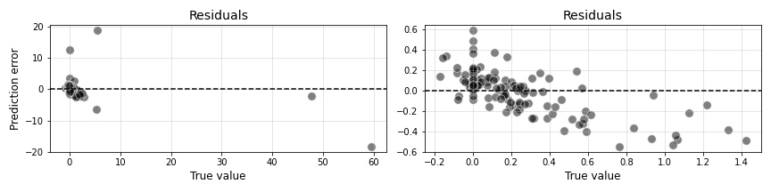
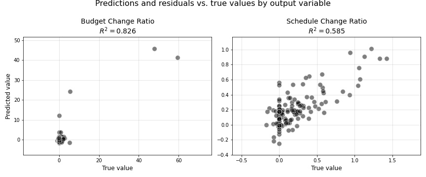
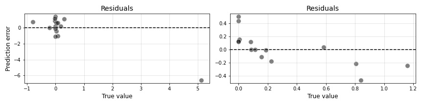

8. Smoothing spline generalized additive models (GAMs)
======================================================

The unabridged notebook used to generate the findings in this section can be `found here on GitHub <https://github.com/sedelmeyer/nyc-capital-projects/blob/master/notebooks/08_smoothing_spline_models.ipynb>`_.

.. contents:: In this section
  :local:
  :depth: 2
  :backlinks: top

Smoothing spline GAMs with baseline predictors
----------------------------------------------

As a first step toward developing our smoothing spline GAMs, we will train a model using the same baseline set of predictors we used in our baseline linear regression model in section 4.1. above.

Identifying the optimal values :math:`\lambda`
^^^^^^^^^^^^^^^^^^^^^^^^^^^^^^^^^^^^^^^^^^^^^^

Using gridsearch to find optimal value :math:`\lambda` for each term in the smoothing spline GAM model:

* Here we treat each y output independently, partly because PyGam's Linear GAM will not fit a multi-output model, but mostly because each y output behaves differently and we have found that different :math:`\lambda` penalty values are required to optimize outputs for both of our response variables.

* In the coded cell below, we use PyGam's native ``gridsearch`` method to choose our values :math:`\lambda` for each term.
  
  * Because there are so few instances of some project categories, traditional cross-validation using k-splits creates split-instances where some categories are missing from our training splits
  
  * When that occurs, PyGam cannot fit a coefficient to that category and generates an error.

**Gridsearch results for BUDGET_CHANGE_RATIO prediction model:**

.. code-block::

    LinearGAM                                                                                                 
    ================================= =================================
    Distribution:          NormalDist Effective DoF:            18.7569
    Link Function:       IdentityLink Log Likelihood:         -419.7587
    Number of Samples:            134 AIC:                     879.0312
                                      AICc:                    886.2739
                                      GCV:                      11.5842
                                      Scale:                     8.7077
                                      Pseudo R-Squared:          0.8263
    ===================================================================
    Feature Function  Lambda      Rank    EDoF   P > x       Sig. Code
    ================= =========== ======= ====== =========== ==========
    s(0)              [0.001]     20      17.4   1.11e-16    ***
    s(1)              [100000.]   20      1.1    9.77e-01
    f(2)              [215.4435]  11      0.3    2.42e-01
    intercept                     1       0.0    7.88e-15    ***
    ===================================================================
    Significance codes:  0 '***' 0.001 '**' 0.01 '*' 0.05 '.' 0.1 ' ' 1

    WARNING: Fitting splines and a linear function to a feature
             introduces a model identifiability problem which can cause
             p-values to appear significant when they are not.

    WARNING: p-values calculated in this manner behave correctly for
             un-penalized models or models with known smoothing
             parameters, but when smoothing parameters have been
             estimated, the p-values are typically lower than they
             should be, meaning that the tests reject the null too
             readily.

**Gridsearch results for SCHEDULE_CHANGE_RATIO prediction model:**

.. code-block::

    LinearGAM                                                                                                 
    ================================= =================================
    Distribution:          NormalDist Effective DoF:             13.003
    Link Function:       IdentityLink Log Likelihood:        -1023.9024
    Number of Samples:            134 AIC:                    2075.8107
                                      AICc:                   2079.3417
                                      GCV:                       0.0557
                                      Scale:                     0.0461
                                      Pseudo R-Squared:            0.58
    ===================================================================
    Feature Function  Lambda      Rank    EDoF   P > x       Sig. Code
    ================= =========== ======= ====== =========== ==========
    s(0)              [100000.]   20      4.0    3.52e-02    *
    s(1)              [27.8256]   20      4.3    3.36e-14    ***
    f(2)              [3.5938]    11      4.7    7.18e-07    ***
    intercept                     1       0.0    2.02e-13    ***
    ===================================================================
    Significance codes:  0 '***' 0.001 '**' 0.01 '*' 0.05 '.' 0.1 ' ' 1

    WARNING: Fitting splines and a linear function to a feature
             introduces a model identifiability problem which can cause
             p-values to appear significant when they are not.

    WARNING: p-values calculated in this manner behave correctly for
             un-penalized models or models with known smoothing
             parameters, but when smoothing parameters have been
             estimated, the p-values are typically lower than they
             should be, meaning that the tests reject the null too
             readily.

In the output summaries above, we can see that PyGam's native gridsearch has identified significantly different optimat penalty values :math:`\lambda` for each term with within each model. What's more, those optimal values :math:`\lambda` also vary greatly among terms between each model, whether it's fit to predict ``Budget_Change_Ratio`` or ``Schedule_Change_Ratio``.

Fitting the model
^^^^^^^^^^^^^^^^^

Now we will use those optimal :math:`\lambda` values to fit our final GAM models using just our baseline predictors.

These smoothing spline GAMs have been fit using the optimal :math:`\lambda` penalties for each term, one set of results show models optimized for BUDGET_CHANGE_RATIO predictions, the other for SCHEDULE_CHANGE_RATIO predictions.

.. code-block::

    The predictors used are:

        ['Budget_Start', 'Duration_Start', 'Category_Code']

    MODEL SUMMARY:
    Smoothing spline GAM: sigmoid scaled, BUDGET_CHANGE_RATIO
    optimal penalties selected

    The fitted model object(s):

        LinearGAM(callbacks=[Deviance(), Diffs()], fit_intercept=True, 
    max_iter=100, scale=None, terms=s(0) + s(1) + f(2) + intercept, 
    tol=0.0001, verbose=False)

        LinearGAM(callbacks=[Deviance(), Diffs()], fit_intercept=True, 
    max_iter=100, scale=None, terms=s(0) + s(1) + f(2) + intercept, 
    tol=0.0001, verbose=False)

    This model resulted in the following R-squared scores:

        Budget_Change_Ratio

            Training    0.8263
            Test        -0.8736

        Schedule_Change_Ratio

            Training    0.3532
            Test        0.0337

    MODEL SUMMARY:
    Smoothing spline GAM: sigmoid scaled, SCHEDULE_CHANGE_RATIO
    optimal penalties selected

    The fitted model object(s):

        LinearGAM(callbacks=[Deviance(), Diffs()], fit_intercept=True, 
    max_iter=100, scale=None, terms=s(0) + s(1) + f(2) + intercept, 
    tol=0.0001, verbose=False)

        LinearGAM(callbacks=[Deviance(), Diffs()], fit_intercept=True, 
    max_iter=100, scale=None, terms=s(0) + s(1) + f(2) + intercept, 
    tol=0.0001, verbose=False)

    This model resulted in the following R-squared scores:

        Budget_Change_Ratio

            Training    0.0748
            Test        -1.8993

        Schedule_Change_Ratio

            Training    0.5800
            Test        0.5373

Here we can see that we stand to benefit from the added expressiveness of a smoothing spline class of linear model, as is illustrated by the improved :math:`R^2` results shown above. However, while our ``Schedule_Change_Ratio`` predictions have improved from :math:`R^2=0.34` to :math:`R^2=0.54`, our ``Budget_Change_Ratio`` test :math:`R^2` score is still extremely negative. However, the smoothing spline GAM does appear to have fitted the training set with a ``Budget_Change_Ratio`` :math:`R^2` score of 0.54, which is somewhat promising. Now, if only we can improve on this to find a model that generalizes when applied to unseen data.

Examining the results
^^^^^^^^^^^^^^^^^^^^^

But, before we introduce any added complexity into this model, let's first look at our true versus predicted values as we did for our Baseline linear regression model at the end of section 4.1.

   Figure 45: Smoothing spline training predictions using baseline features

   Figure 46: Smoothing spline TEST predictions using baseline features

While we do see some mild imporvement in our residuals above, the most striking characteristic of these results when compared to the comparable plots for our Baseline linear regression model, is that the TEST predictions appear to be far more evenly distributed among the bulk of our true test values. This is a marked improvement and indicates that the predictive accuracy of this smoothing spline GAM is far less influenced by the extreme outliers in our dataset.

Now, as one final step, in lieu of having coefficient estimates like we had in our linear regression output, let's take a look at the "contribution" of each predictor to our overall GAM models using partial dependence and 95% confidence intervals.

   Figure 47: Partial dependence contribution by feature for the ``Budget_Change_Ratio``-optimized model

   Figure 48: Partial dependence contribution by feature for the ``Schedule_Change_Ratio``-optimized model

As can be seen in the partial dependence plots above, again we see a model that doesn't appear to know what to do with our ``Budget_Change_Ratio`` response variable as is evidenced by the largely uniform horizontal relationships of each predictor variable in terms of their contribution to the overall model.

For ``Schedule_Change_Ratio`` on the otherhand, we can see far more significant contributions made to the model by each predictor. Not only is a positive linear relationship evidenced by the ``Budget_Start`` predictor, but ``Duration_Start`` appears to be negatively correlated in a curvalinear fashion, and several of the ``Category`` types appear to have a signigicant effect on our predictions as we might expect. 

Smoothing spline GAMs with engineered features
----------------------------------------------

Now that we have analyzed our results for the simplest comparable smoothing spline GAM we could have created, we move on to a slightly more complex version of the model wherein we search for the optimal combination of engineered features and combine those with our baseline predictors ``Budget_Start`` and ``Schedule_Start``. 

What we show here is only the best performing predictor iterations we could identify for predicting both ``Budget_Change_Ratio`` and ``Schedule_Change_Ratio`` separately.

Ultimately, **for predicting** ``Budget_Change_Ratio`` **, we use the predictors** ``Budget_Start``, ``Duration_Start``, and the engineered attribute encoding features ``umap_attributes_2D_embed_1``, and ``umap_attributes_2D_embed_2``.

As **for our model predicting** ``Schedule_Change_Ratio`` **, we use the predictors** ``Budget_Start``, ``Duration_Start``, the engineered reference class clusters identified using UMAP combined with HDBSCAN named ``attribute_clustering_label``, as well as the PCA dimension-reduced encoding our project description text BERT embeddings ``pca_descr_embed_1`` and ``pca_descr_embed_2``.

Identifying the optimal values :math:`\lambda`
^^^^^^^^^^^^^^^^^^^^^^^^^^^^^^^^^^^^^^^^^^^^^^

As we did in our previous GAM models, we perform PyGam's native gridsearch to find the optimal :math:`\lambda`'s for each term in each model.

**NOTE:** Gridsearch for these models is computationally intensive, therefore we recommend loading the pretrained PyGam models from disk for further evaluation. If you would like to review the notebook wherein these model objects were created, `please review the unabridged project notebook available on GitHub <https://github.com/sedelmeyer/nyc-capital-projects/blob/master/notebooks/08_smoothing_spline_models.ipynb>`_.

**Gridsearch results for BUDGET_CHANGE_RATIO prediction model:**

.. code-block::

    LinearGAM                                                                                                 
    ================================= =================================
    Distribution:          NormalDist Effective DoF:            20.3443
    Link Function:       IdentityLink Log Likelihood:         -421.6587
    Number of Samples:            134 AIC:                     886.0061
                                      AICc:                    894.5489
                                      GCV:                      12.0984
                                      Scale:                     8.8447
                                      Pseudo R-Squared:           0.826
    ===================================================================
    Feature Function  Lambda      Rank    EDoF   P > x       Sig. Code
    ================= =========== ======= ====== =========== ==========
    s(0)              [0.001]     20      17.4   1.11e-16    ***
    s(1)              [100000.]   20      1.3    9.76e-01
    s(2)              [100000.]   20      1.5    4.71e-01
    s(3)              [100000.]   20      0.2    8.58e-01
    intercept                     1       0.0    5.77e-14    ***
    ===================================================================
    Significance codes:  0 '***' 0.001 '**' 0.01 '*' 0.05 '.' 0.1 ' ' 1

    WARNING: Fitting splines and a linear function to a feature
             introduces a model identifiability problem which can cause
             p-values to appear significant when they are not.

    WARNING: p-values calculated in this manner behave correctly for
             un-penalized models or models with known smoothing
             parameters, but when smoothing parameters have been
             estimated, the p-values are typically lower than they
             should be, meaning that the tests reject the null too
             readily.

**Gridsearch results for SCHEDULE_CHANGE_RATIO prediction model:**

.. code-block::

    LinearGAM                                                                                                 
    ================================= =================================
    Distribution:          NormalDist Effective DoF:              9.944
    Link Function:       IdentityLink Log Likelihood:        -1103.8169
    Number of Samples:            134 AIC:                    2229.5218
                                      AICc:                   2231.6636
                                      GCV:                       0.0511
                                      Scale:                     0.0444
                                      Pseudo R-Squared:          0.5853
    ===================================================================
    Feature Function  Lambda      Rank    EDoF   P > x       Sig. Code
    ================= =========== ======= ====== =========== ==========
    s(0)              [100000.]   20      3.3    1.95e-02    *
    s(1)              [37.2759]   20      3.7    2.22e-16    ***
    f(2)              [37.2759]   7       1.4    1.27e-01
    s(3)              [100000.]   20      0.7    4.15e-06    ***
    s(4)              [517.9475]  20      0.8    2.97e-02    *
    intercept                     1       0.0    1.11e-16    ***
    ===================================================================
    Significance codes:  0 '***' 0.001 '**' 0.01 '*' 0.05 '.' 0.1 ' ' 1

    WARNING: Fitting splines and a linear function to a feature
             introduces a model identifiability problem which can cause
             p-values to appear significant when they are not.

    WARNING: p-values calculated in this manner behave correctly for
             un-penalized models or models with known smoothing
             parameters, but when smoothing parameters have been
             estimated, the p-values are typically lower than they
             should be, meaning that the tests reject the null too
             readily.

Once again, we can see greatly varying optimal $\lambda$ dependent on model and term. We will use these values $\lambda$ now to train models for each of our response variables.

Fitting the model
^^^^^^^^^^^^^^^^^

These smoothing spline GAMs have been fit using the optimal lambda penalties this model was optimized for BUDGET_CHANGE_RATIO predictions::

    The predictors used are:

        ['Budget_Start', 'Duration_Start', 
        'umap_attributes_2D_embed_1', 'umap_attributes_2D_embed_2']

    MODEL SUMMARY:
    FINAL smoothing spline GAM: sigmoid scaled, budget-optimized model

    The fitted model object(s):

        LinearGAM(callbacks=[Deviance(), Diffs()], fit_intercept=True, 
    max_iter=100, scale=None, 
    terms=s(0) + s(1) + s(2) + s(3) + intercept, tol=0.0001, 
    verbose=False)

        LinearGAM(callbacks=[Deviance(), Diffs()], fit_intercept=True, 
    max_iter=100, scale=None, 
    terms=s(0) + s(1) + s(2) + s(3) + intercept, tol=0.0001, 
    verbose=False)

    This model resulted in the following R-squared scores:

        Budget_Change_Ratio

            Training    0.8260
            Test        -1.0543

        Schedule_Change_Ratio

            Training    0.4439
            Test        0.3103

These smoothing spline GAMs have been fit using the optimal lambda penalties this model was optimized for SCHEDULE_CHANGE_RATIO predictions::

    The predictors used are:

        ['Budget_Start', 'Duration_Start',
        'attribute_clustering_label', 'pca_descr_embed_1',
        'pca_descr_embed_2']

    MODEL SUMMARY:
    FINAL smoothing spline GAM: sigmoid scaled, schedule-optimized model

    The fitted model object(s):

        LinearGAM(callbacks=[Deviance(), Diffs()], fit_intercept=True, 
    max_iter=100, scale=None, 
    terms=s(0) + s(1) + f(2) + s(3) + s(4) + intercept, tol=0.0001, 
    verbose=False)

        LinearGAM(callbacks=[Deviance(), Diffs()], fit_intercept=True, 
    max_iter=100, scale=None, 
    terms=s(0) + s(1) + f(2) + s(3) + s(4) + intercept, tol=0.0001, 
    verbose=False)

    This model resulted in the following R-squared scores:

        Budget_Change_Ratio

            Training    0.0543
            Test        -0.7261

        Schedule_Change_Ratio

            Training    0.5853
            Test        0.5501

As can be seen in the printed output above, the first model optimized for ``Budget_Change_Ratio`` predictions has appeared to overfit on the training data with a train :math:`R^2` score of :math:`0.83`, but a test score of :math:`-1.05`. The ``Schedule_Change_Ratio`` optimized model actually achieved a slightly improved (albeit still negative) ``Budget_Change_Ratio`` test score of :math:`-0.73`, while the we were able to squeeze a bit more predictive accuracy out of our ``Schedule_Change_Ratio`` predictions (:math:`0.55` test :math:`R^2`) by incorporating three of our engineered features.

Examining the results
^^^^^^^^^^^^^^^^^^^^^

Now, let's take a quick look at our true versus predicted values for each model.

   Figure 49: Smoothing spline training predictions using final features

   Figure 50: Smoothing spline TEST predictions using final features

As to be expected, the characteristics of the predictions do not vary much visually from our prior GAM, which used just our baseline predictors. I would not expect a :math:`0.53` to :math:`0.55` improvement in ``Schedule_Change_Ratio`` :math:`R^2` to provide much that we would notice visually.

   Figure 51: Partial dependence contribution by feature for the final ``Budget_Change_Ratio``-optimized model

   Figure 52: Partial dependence contribution by feature for the final ``Schedule_Change_Ratio``-optimized model

In our partial dependence plots above, once again we see the familiar trend where our model has extreme difficulty finding any significant relationship between our predictors and the ``Budget_Change_Ratio`` response variable. And, similar to before, we see significant contribution relationships expressed for the predictors in our ``Schedule_Change_Ratio`` model.

Final thoughts on smoothing spline GAMs
---------------------------------------

While the expressiveness of smoothing splines helped fit a more robust model to our ``Schedule_Change_Ratio`` response variable, it has become clear that this class of linear model will not be sufficient to predict ``Budget_Change_Ratio``. We have yet to encounter a model that performs better than a naive model as has been evidenced by our negative :math:`R^2` test scores. For this reason, we will now move on to a non-parametric class of models Decision Trees and Decision Tree Ensemble methods to see if we can generate at least some predictive accurace for ``Budget_Change_Ratio`` and further improve our predictions for ``Schedule_Change_Ratio``.