8. Decision tree models
=======================

The unabridged notebook used to generate the findings in this section can be `found here on GitHub <https://github.com/sedelmeyer/nyc-capital-projects/blob/master/notebooks/09_decision_tree_models.ipynb>`_.

.. contents:: In this section
  :local:
  :depth: 2
  :backlinks: top

In this section, we take several approaches to fitting tree-based models on our data. First, in an attempt to identify what to expect from our performance using trees, we find the optminal combinations of features to perform the task of classifying each project as either over or not-over budget and over or not-over schedule at the end of the 3-year interval. We do this as an initial check on the effectiveness of trees and to identify which features seem to have the largest influence on whether a project is classified as likely to be either over budget or over schedule.

Next, we perform the same sort of feature-space exploration to find the optimal combination of feature with which to fit Decision Tree Regressors for predicting both ``Budget_Change_Ratio`` and ``Schedule_Change_Ratio``. There we perform some of the same interpretive analysis of the resulting trees and tree depths.

Finally, we move on to the decision tree ensemble method known as Boosting, implemented with ``scikit-learn``'s ``AdaBoost``. Here we seek to identify the most robust model available on our limited set of data, primarily as a proof-of-value for further exploration of the problem, should we be able to later identify a larger set of data to perform more intensive model.

Decision tree classification models
-----------------------------------

Here, we only predict whether the final values are higher or lower than the original start. The custom ``iterate_tree_models`` function used below can be found in the ``../src/caproj/trees.py`` available in our GitHub repository. This function iterates through a wide range of possible tree depth and predictor combinations to identify partially optimized model configurations for predicting ``Budget_Change_Ratio`` and ``Schedule_Change_Ratio`` separately.

**ADD TREE ITERATION COUNT INFO**

Now that we've generated a dataframe storing the results of our tree depth and predictor-space search, we will look at the two tree model configurations identified as "best" for our two response variables.

**First, our best Budget Change results.**

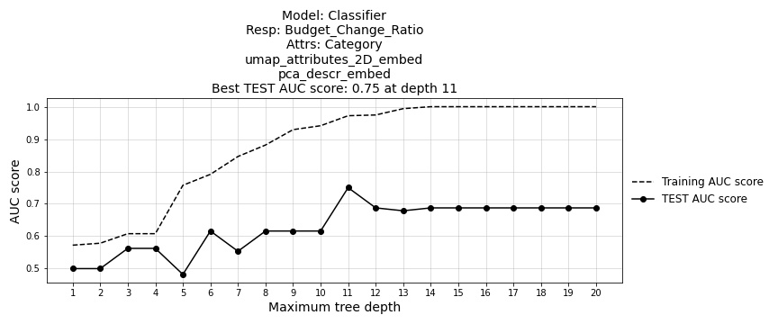

   Figure 53: ``Budget_Change_Ratio`` decision tree classifier model AUC score by maximum tree depth

.. code-block::

    Index Chosen: 54
    Best AUC Score of Model Chosen: 0.75
    Model Depth: 11
    Model Attributes:
        ['Category', 'umap_attributes_2D_embed', 'pca_descr_embed']
    Model Response:
        ['Budget_Change_Ratio']

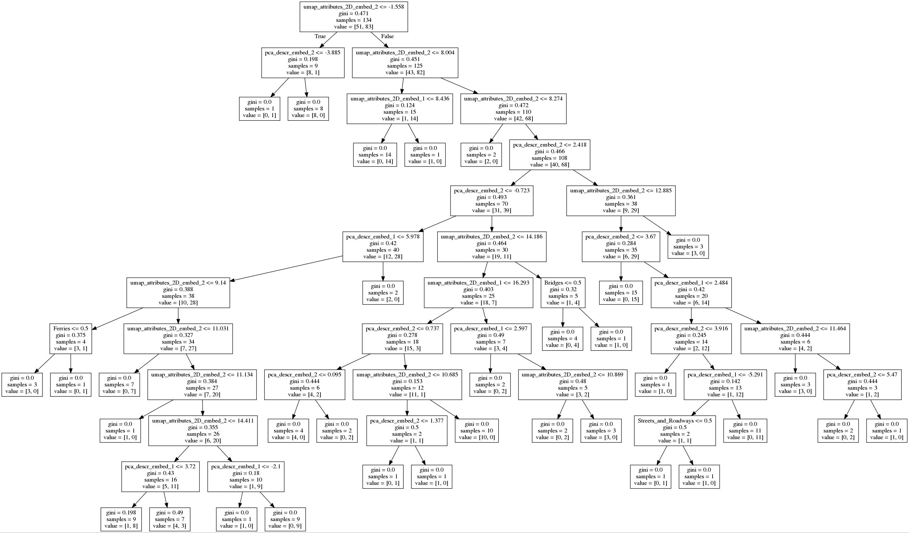

   *(Click image to view details.)*

   Figure 54: ``Budget_Change_Ratio`` decision tree classifier diagram

**Then our best Schedule Change results.**

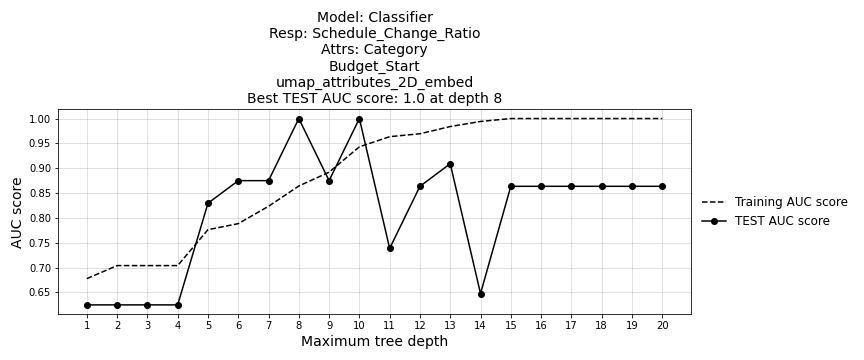

   Figure 55: ``Schedule_Change_Ratio`` decision tree classifier model AUC score by maximum tree depth

.. code-block::

    Index Chosen: 89
    Best AUC Score of Model Chosen: 1.00
    Model Depth: 8
    Model Attributes:
        ['Category', 'Budget_Start', 'umap_attributes_2D_embed']
    Model Response:
        ['Schedule_Change_Ratio']

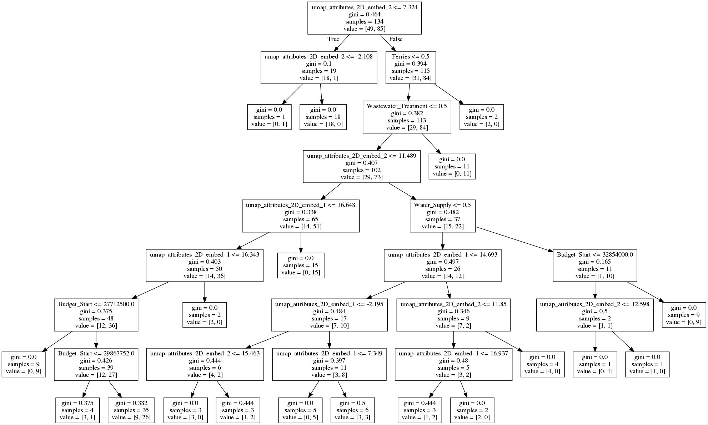

   *(Click image to view details.)*

   Figure 56: ``Schedule_Change_Ratio`` decision tree classifier diagram

As described in the intro to this sectinon, these models illustrated above will only try to predict if the budget or schedule will be over or under the initial estimate after a 3-year period.

As expected, the optimal models for predicting 'Schedule' and 'Budget' are different and both models produce trees with a depth of significant complexity.

**The optimal 'Budget' model uses the following parameters to predict "Budget Change Ratio":**

* Predictors: ``Category``, ``umap_attributes_2D_embed``, ``pca_descr_embed``

* Best depth: 11
* Best AUC score: 0.75

Here, the project textual description (as represented by the PCA reduced BERT embeddings) is inidicative of the budget outcome.  Worth noting is that the ``Budget_Start`` predictor is not useful in finding the optimal model to predict the budget outcome.

**The optimal 'Schedule' model uses the following parameters to predict "Schedule Change Ratio":**

* Predictors: ``Category``, ``Budget_Start``, ``umap_attributes_2D_embed``

* Best depth: 8
* Best AUC score: 1.0

Of note is that attributes using the project description embeddings were not selected while identifying the optimal model configuration. Also interesting is that the ``Duration_Start`` (i.e. starting planned schedule) was not identified as useful for predicting the schedule overage outcome.

Now, armed with this insight, we move on to identifying the optimal decision tree regressors.

Decision tree regression models
-------------------------------

The unabridged notebook used to generate the findings in this section can be `found here on GitHub <https://github.com/sedelmeyer/nyc-capital-projects/blob/master/notebooks/09_decision_tree_models.ipynb>`_.

Similar to the algorithmic search we performed above to identify the optimal model configurations for our decision tree classifiers, we now do the same to identify our optimal decision tree regressors. The following steps will find the best combination of attributes to find the models which best predict ``Schedule_Change_Ratio`` and ``Budget_Change_Ratio``.

**First, our best** ``Budget_Change_Ratio`` **regressor results.**

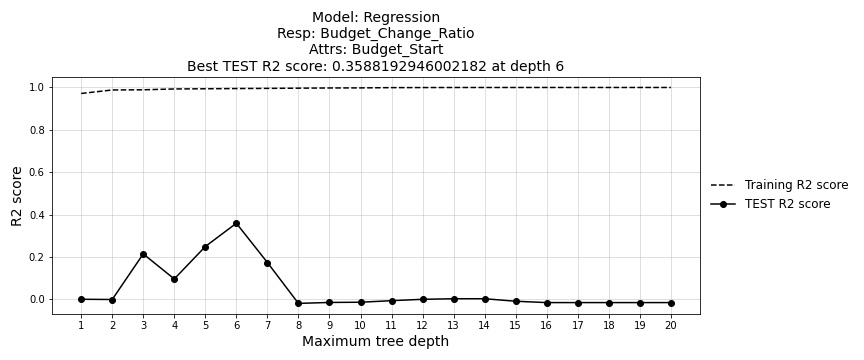

   Figure 57: ``Budget_Change_Ratio`` decision tree regressor model :math:`R^2` score by maximum tree depth

.. code-block::

    Index Chosen: 8
    Best AUC Score of Model Chosen: 0.3588
    Model Depth: 6
    Model Attributes:
        ['Budget_Start']
    Model Response:
        ['Budget_Change_Ratio']

    MODEL SUMMARY:
    Regression Tree. Depth: 6

    The fitted model object(s):

        DecisionTreeRegressor(max_depth=6, random_state=109)

        DecisionTreeRegressor(max_depth=6, random_state=109)

    This model resulted in the following R-squared scores:

        Budget_Change_Ratio

            Training    0.9949
            Test        0.3588

        Schedule_Change_Ratio

            Training    0.5633
            Test        -1.0067

As we can see above, this ``Budget_Change_Ratio`` optimized decision tree regressor offers a marked improvement over all prior models for predicting ``Budget_Change_Ratio``. Whereas our best model prior to this one still had an test :math:`R^2` score of less than :math:`0`, we are now achieving a test score of :math:`0.36`. This is extremely promising.

What's interesting however, is that this optimal model uses ``Budget_Start`` as it's **only** predictor for generating results.

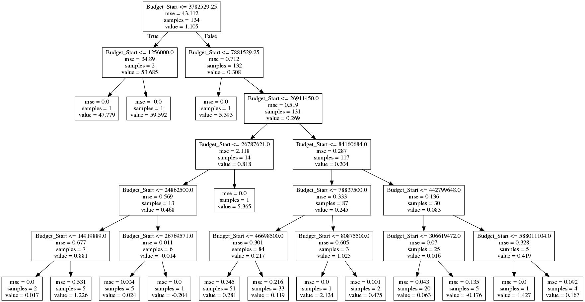

   *(Click image to view details.)*

   Figure 58: ``Budget_Change_Ratio`` decision tree regressor diagram

When we inspect the resulting tree diagram, we can see the many decision nodes generate off of this singular predictor.

**Now, our best** ``Schedule_Change_Ratio`` **regressor results.**

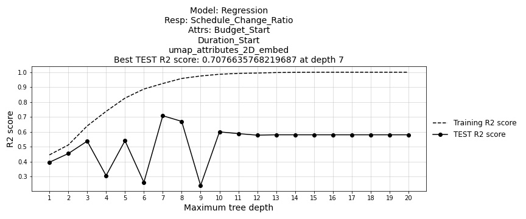

   Figure 59: ``Schedule_Change_Ratio`` decision tree regressor model :math:`R^2` score by maximum tree depth

.. code-block::

    Index Chosen: 105
    Best AUC Score of Model Chosen: 0.7077
    Model Depth: 7
    Model Attributes:
        ['Budget_Start', 'Duration_Start',
        'umap_attributes_2D_embed']
    Model Response:
        ['Schedule_Change_Ratio']

    The fitted model object(s):

        DecisionTreeRegressor(max_depth=7, random_state=109)

        DecisionTreeRegressor(max_depth=7, random_state=109)

    This model resulted in the following R-squared scores:

        Budget_Change_Ratio

            Training    0.9968
            Test        -0.1285

        Schedule_Change_Ratio

            Training    0.9240
            Test        0.7077

Once again we are pleased with our results. The best decision tree regressor model for predicting ``Schedule_Change_Ratio`` has increased our best test :math:`R^2` score from :math:`0.55` as was seen in our smoothing spline GAM, up to :math:`0.71` as is shown above.

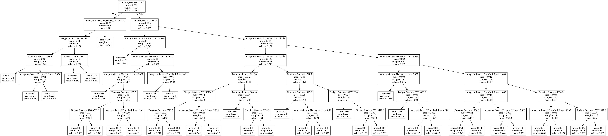

   *(Click image to view details.)*

   Figure 60: ``Schedule_Change_Ratio`` decision tree regressor diagram

Additionally, this ``Schedule_Change_Ratio`` tree regressor used a larger feature set and the best ``Budget_Change_Ratio`` model reviewed above. Here we use ``Budget_Start``, ``Duration_Start``, and ``umap_attributes_2D_embed`` to generate our predictions.

Now, as one final step, we will visually inspect our true versus predicted values for each of our best models.

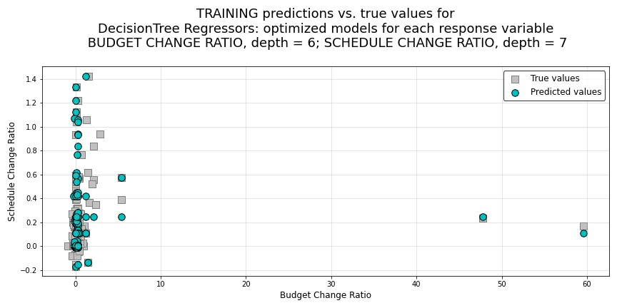

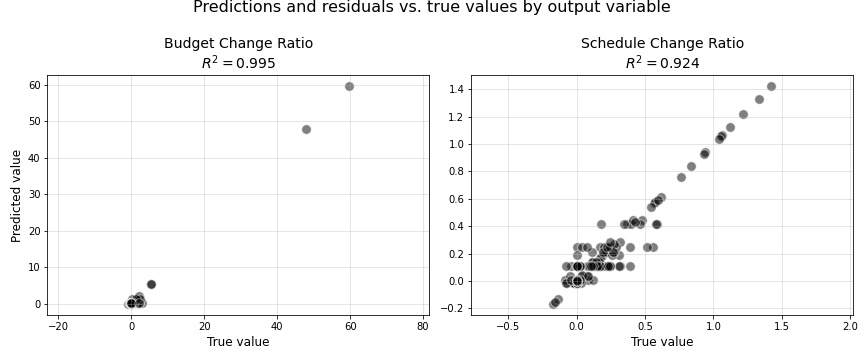

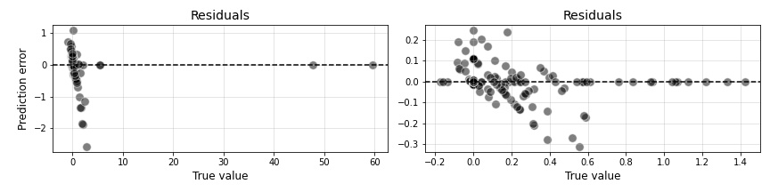

   Figure 61: Decision tree regressor training predictions using final features

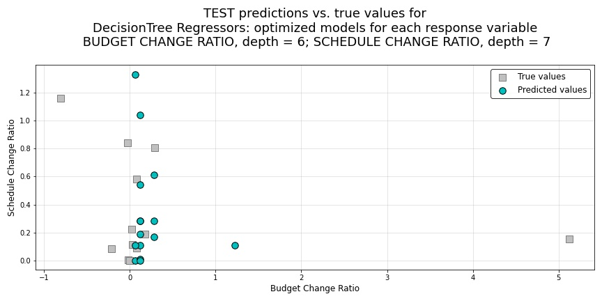

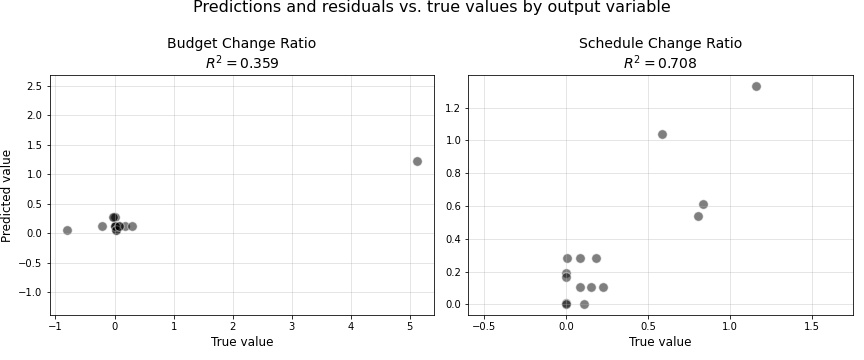

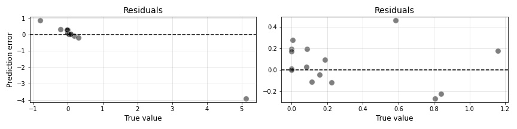

   Figure 62: Decision tree regressor TEST predictions using final features

These models attempt to predict the ending ``Schedule_Change_Ratio`` and ``Budget_Change_Ratio`` values after a 3-year period.

As expected, the optimal models for predicting *Schedule* and *Budget* are different and both models produce trees with a depth of significant complexity, albeit one model uses only one singular predictor.

**The optimal 'Budget' model uses the following parameters to predict** ``Budget_Change_Ratio``

* Predictors: ``Budget_Start``
* Best depth: 6
* Best :math:`R^2` score: 0.3588

Here, only the starting budget value is determined to be significant when predicting ``Budget_Change_Ratio``.  The :math:`R^2` score is not exceptionally impressive which may be the result of some extreme outliers in the data, but is still a considerable improvement over the negative scores seen in our prior models. 

**The optimal 'Schedule' model uses the following parameters to predict** ``Schedule_Change_Ratio``

* Predictors: ``Budget_Start``, ``Duration_Start``, ``umap_attributes_2D_embed``
* Best depth: 7
* Best :math:`R^2` score: 0.7077

Of note, once again, is that 2D attributes derived from the BERT description-text embeddings were not identified as components of our optimal ``Schedule_Change_Ratio`` model.