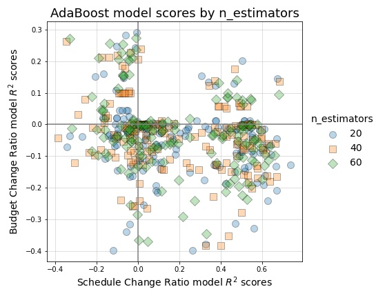
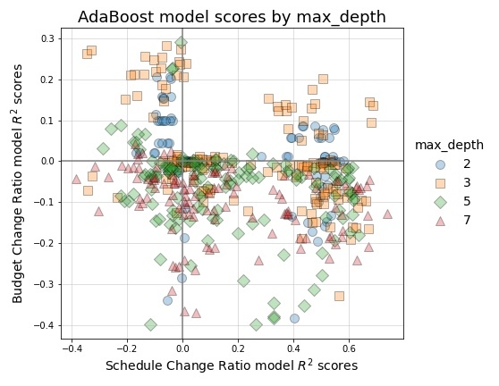
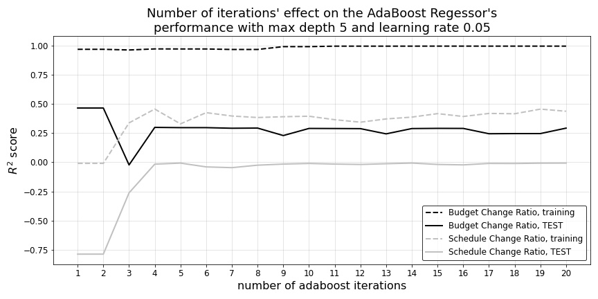
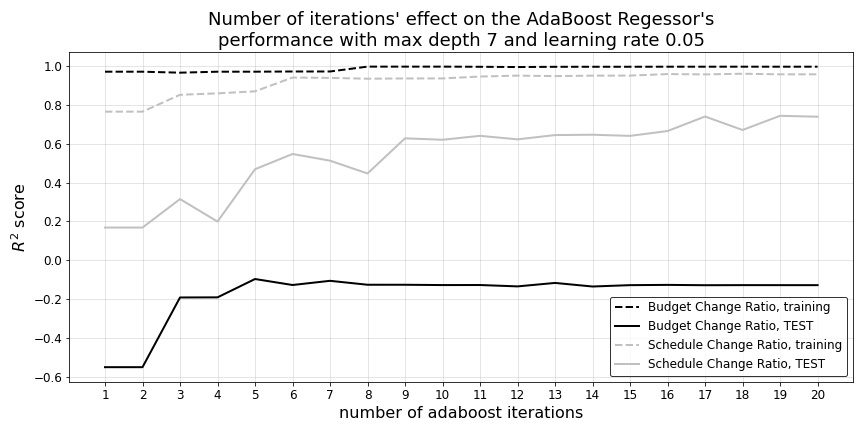
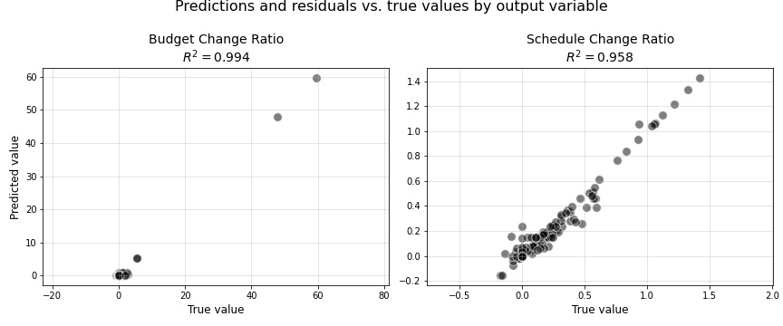
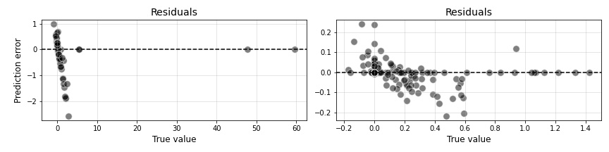
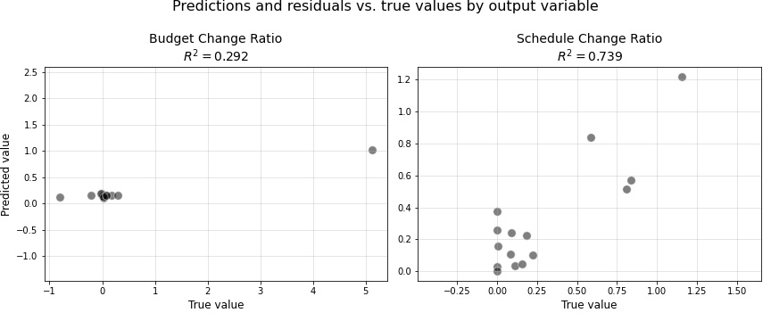
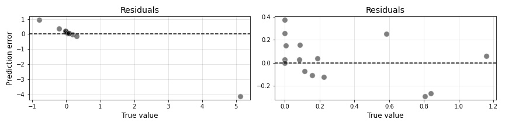

10. Ensemble tree regressors with boosting
==========================================

The unabridged notebook used to generate the findings in this section can be `found here on GitHub <https://github.com/sedelmeyer/nyc-capital-projects/blob/master/notebooks/10_ensemble_tree_models.ipynb>`_.

.. contents:: In this section
  :local:
  :depth: 2
  :backlinks: top

In this section, we continue with the nonparatric models by applying Boosting to our model search using ``scikit-learn``'s implementation of ``AdaBoost``.  Boosting will use an ensemble of models to find an optimal model with a minimal number of iterations. Boosting achieves this by weighting observations with incorrect predictions more heavily in an effort to better learn those hard-to-learn feature relationships.

Iterate over possible model feature combinations
------------------------------------------------

As with the previous models, this section will iterate over all possible combination of attributes and responses to find the best model.  Additionally, we iterate over options for various AdaBoost paramaters including ``max_depth`` for our base classifier as well as a few competing values for ``n_estimators``, which specified how many boosting iterations should be executed by the algorithm. The process creates 672 models from which we select the best performing configurations.

**ADD INFORMATION ABOUT THE NUMBER OF ADABOOST ITERATIONS**

Review the impact of estimators and depth on our results
--------------------------------------------------------

Now that we've completed the search of our model-space and saved our results to a dataframe, we will first visually inspect the effect that our two ``AdaBoost`` model parameters had on our results. 

   Figure 63: AdaBoost model scores based on number of estimators used for each model

Here we are checking to see if there is any pattern in the `n_estimators` parameter creating clusters or unique distributioins relative to our resulting ``Schedule_Change_Ratio`` an ``Budget_Change_Ratio`` :math:`R^2` scores.  We observe no trend that indicates any value performs consistently better than the others. However, something worth notings, is that after examining our final "best" model results, we will have realized that should have perhaps explored values of even fewer iterations that explored here. 

   Figure 64: AdaBoost model scores based on max depth of each model

Similar to the visual inspection we conducted above for ``n_estimators``, here we want to see if the maximum tree depth of our base classifier has any consistent impact on :math:`R^2` performance of the resulting models.  We notice that the max depths of 3 perform consistently better with schedule change; however the best budget change model has a max depth of 5.  Since ``AdaBoost`` learns 'fast' by also considering errors in training iterations, we can expect that lower numbers for ``max_depth`` would product good results. Predicting Budget values has been consistently more difficuly, so it makes sense that a larger ``max_depth`` is needed to find the optimal model for predicting the ``Budget_Change_Ratio`` response values.

Review best performing model's staged scores
--------------------------------------------

Now that we've visualized the effect of ``max_depth`` and ``n_estimators`` across our entire set of trained models, we will inspect the best performing ``Budget_Change_Ratio`` and ``Schedule_Change_Ratio`` models identified during this search.

   Figure 65: ``Budget_Change_Ratio`` best AdaBoost model staged scores

Best BUDGET CHANGE RATIO Prediction Model (shown above)::

    Train Score:   0.994
    Test Score:    0.2921

   Figure 66: ``Schedule_Change_Ratio`` best AdaBoost model staged scores

Best SCHEDULE CHANGE RATIO Prediction Model (shown above)::

    Train Score:   0.9576
    Test Score:    0.7392

Above, when we examine the staged scores for each iteration of the optimal ``Budget_Change_Ratio`` model (upper plot) versus the optimal ``Schedule_Change_Ratio`` model (lower plot), we can see significant differences in the training and test performance for both response variables. As is evidenced by these charts, at all numbers of iterations, the ``AdaBoost`` model optimized for ``Schedule_Change_Ratio`` performs horribly on ``Budget_Change_Ratio`` and vice versa. What's even more compelling is the promise we can see for achieving far higher `Budget_Change_Ratio` test scores by training our ``AdaBoost`` model for only 1 to 2 iterations (with an approximate :math:`R^2` of :math:`0.48`). Looking at the top chart, this can be seen by examining the solid black line. 

The major caveat however, looking at these plots are, we have not performed a proper exercise cross-validating our model scores with a validation set over a number of k-folds. As was mentioned in an earlier section of this report, the extremely small sample size and sparsity of a number of our categorical variables prevents us from being able to perform an effective gridsearch with proper cross-validation. Therefore, we can only consider these model results a proof of concept or proof of value for our modelling approach, which would then need to be subjected to more principled tests with a much more robust set of project data.

Examining the results
---------------------

Now, as our final step, we examine our predicted values against the true values of our train and test sets.

.. figure:: ../../docs/_static/figures/67-pred-boost-final-train-1.jpg
   :align: center
   :width: 100%

   Figure 67: AdaBoost regressor training predictions

.. figure:: ../../docs/_static/figures/68-pred-boost-final-test-1.jpg
   :align: center
   :width: 100%

   Figure 68: AdaBoost regressor TEST predictions

Thinking back to the results we had seen in our baseline model, we are extremely pleased with the far improved results we are seeing here from our best ``AdaBoost`` models. Not only are we achieving much improved :math:`R^2` scores on our ``Budget_Change_Ratio`` and ``Schedule_Change_Ratio`` predictions, but we are also seeing test predictions that distribute themselve well across the range of true ``Schedule_Change_Ratio`` values, and we can even see our ``Budget_Change_Ratio`` test predictions making an effort predict the presence of particular outliers in the data.
