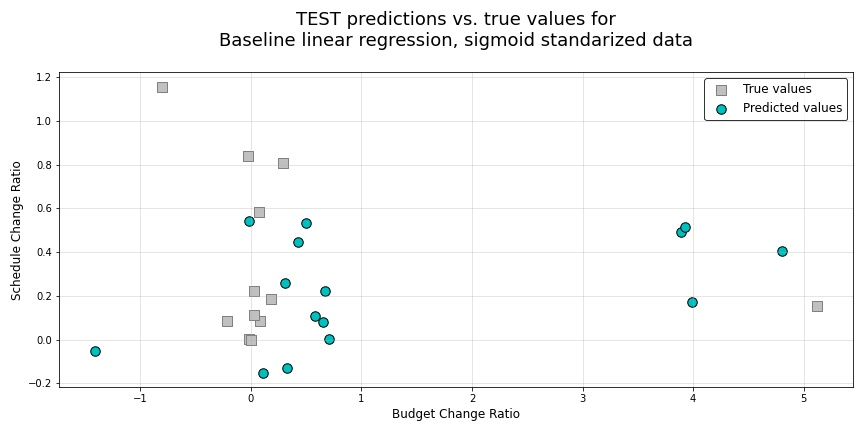

11. Conclusions and future work
===============================

.. contents:: In this section
  :local:
  :depth: 2
  :backlinks: top

Conclusions
-----------

Not surprisingly, linear models lacked the expressiveness needed to successfully model our predictions, particularly those for predicting ``Budget_Change_Ratio`` on our test projects. Not only were there drastic differences in the predictive performance of models on both ``Budget_Change_Ratio`` and ``Schedule_Change_Ratio`` as our primary response variables, but models also needed to be individually parameterized for optimal predictions on each of those two response variables.

.. figure:: ../../docs/_static/figures/42-pred-linear-base-train-1.jpg
   :align: center
   :width: 100%

   Figure 42 (detail): Baseline linear model training predictions versus true values

.. figure:: ../../docs/_static/figures/49-pred-spline-final-train-1.jpg
   :align: center
   :width: 100%

   Figure 49 (detail): Smoothing spline final GAM training predictions versus true values

   Figure 67 (detail): AdaBoost ensemble tree regressor model training predictions versus true values

In the end, through the use of ensemble decision tree regressors using boosting, we were able to achieve test :math:`R^2` scores of 0.48 on our budget change ratio predictions and 0.70 on our schedule change predictions. While there is still a great deal of additional work we can put towards this problem, we feel that this analysis is a good starting point for more principled exploration.

   Figure 43 (detail): Baseline linear model TEST predictions versus true values

.. figure:: ../../docs/_static/figures/50-pred-spline-final-test-1.jpg
   :align: center
   :width: 100%

   Figure 50 (detail): Smoothing spline final GAM TEST predictions versus true values

   Figure 68 (detail): AdaBoost ensemble tree regressor model TEST predictions versus true values

Next steps and future work
--------------------------

At most we can consider our work here a proof-of-concept. Our sample size was far too small and our available data was far too limiting. Below are a few key issues and next steps we'd seek to address if we decide to continue explorating this problem-space.

1. First we would seek to identify a more robust source of data for deeper and more principled analysis. Not only would we seek a larger sample set of projects to evaluate, but we would also seek far richer sources of information. To successfully achieve this, we would likely need to partner with a public or private organization as part of a long-term student that would be willing to grant us in-depth and complete project records from many different data sources and of many different data types for a truly robust predictive model that will have the accuracy and specificity to be of use for a managing organization.

2. We would also look into methods for controlling for the human element of data generation in our models. The process by which project data is created, updated, and maintained is flawed and prone to the effects of adverse incentives and management pressures placed on the project managers and administrators responsible for maintaining that data. In the case that we are able to gain the type of access to project records describe in bullet 1 above, we'd also have to give a great deal of consideration to how we control for these human factors in our data.

3. We'd also like to acknowledge that one metric cannot capture all aspects of a "successful" project . Here we used "Budget Change Ratio" and "Schedule Change Ratio" as our target variables, but as the literature suggests, there are various metrics that can capture project success. A small change in Budget Change Ratio or Schedule Change Ratio may mean that millions of dollars were overspent or the projects were delayed for many years. To get a holistic view of project success, we should consider all of the following metrics:

  * Absolute percentage error: ``|Forecast − Actual|/Actual``

  * Relative percentage error (referred to as cost escalation in project estimation literature): ``|Forecast − Actual|/Forecast``
    
  * Ratios: ``Forecast/Actual``
    
  * Actual/Forecast Difference: ``Actual − Forecast``

  * Days delayed (only the positive differences)

  * Absolute error: ``|Forecast − Actual|``

  * Squared error: ``(Forecast − Actual)^2``